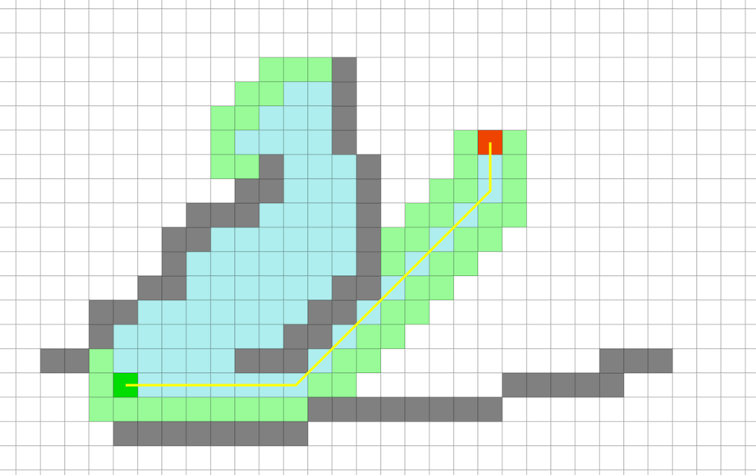
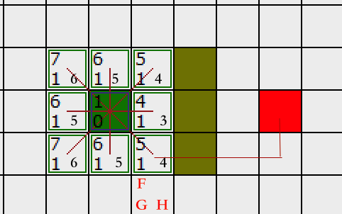
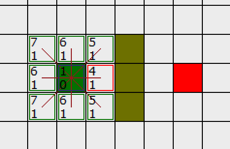
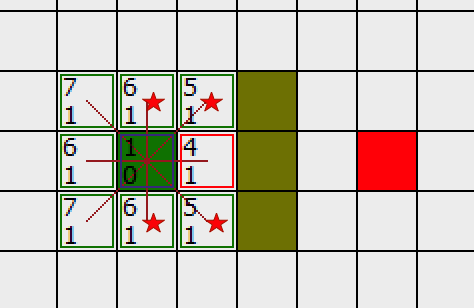
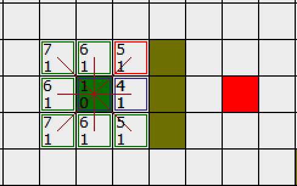
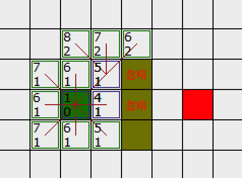
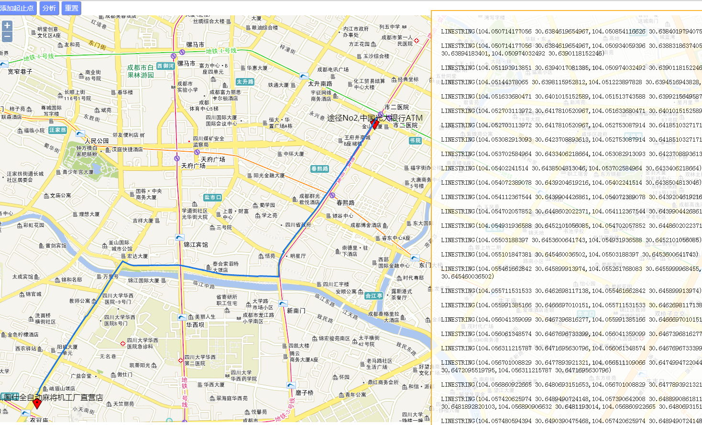

# A星算法介绍及实现 

# 简介 

> In [computer science](https://en.wikipedia.org/wiki/Computer_science), **A\*** (pronounced as "A star") is a [computer algorithm](https://en.wikipedia.org/wiki/Computer_algorithm) that is widely used in [pathfinding](https://en.wikipedia.org/wiki/Pathfinding) and [graph traversal](https://en.wikipedia.org/wiki/Graph_traversal), the process of plotting an efficiently directed path between multiple points, called nodes. It enjoys widespread use due to its [performance](https://en.wikipedia.org/wiki/Computer_performance) and accuracy. However, in practical travel-routing systems, it is generally outperformed by algorithms which can pre-process the graph to attain better performance,[[1\]](https://en.wikipedia.org/wiki/A*_search_algorithm#cite_note-1) although other work has found A* to be superior to other approaches.[[2\]](https://en.wikipedia.org/wiki/A*_search_algorithm#cite_note-Zeng-2)			--[wikipedia](https://en.wikipedia.org/wiki/A*_search_algorithm)

`A*寻路`算法是比较流行的启发式搜索算法之一，被广泛应用于路径优化领域。它的独特之处是检查最短路径中每个可能的节点时引入了全局信息，对当前节点距终点的距离做出估计，并作为评价该节点处于最短路线上的可能性的量度。 

当你玩War3，Dota, 等RTS(即时战略)游戏，当你给里面的人物下达移动指令时，就是基于格子地图使用了`A*`算法来进行路径分析的. 当然了诸如冰霜飞龙奇美拉是不需要考虑阻挡的啦，直接飞直线就行了(三本兵就是屌233)      

# 效果 

网上A星算法可视化的比较多 推荐2个Demo  

[阿姆斯特丹路网--A*寻路Demo](https://anvaka.github.io/ngraph.path.demo/#?graph=amsterdam-roads)   [源码](https://github.com/anvaka/ngraph.path)  

作者将荷兰阿姆斯特丹城市的路网经过pbf编码压缩，使得7万6千条边数据压缩到了1.1M大小，然后通过A星算法进行最短路径分析，性能强大到鼠标拖动B点到哪里，路径分析就到哪里。 左上角是耗时，8.85毫秒  

第二个Demo对于理解A星算法有很大帮助 

[PathFinding.js/visual](http://qiao.github.io/PathFinding.js/visual/)  [源码](https://github.com/qiao/PathFinding.js) 

 

下图是相同起止点，使用`迪杰斯特拉算法`进行路径分析的结果 ，可以明显看到，分析的节点比A*多了很多,耗时也多了很多，效率优劣不言而喻了.   

 

# 算法详解 

如图所示简易网格地图, 其中绿色方块的是起点 (用 A 表示), 中间绿色的是障碍物(不可走), 红色的方块 (用 B 表示) 是目的地. 为了可以用一个二维数组来表示地图, 我们将地图划分成一个个的小方块.

## 开始搜索 

### 1. 起点加入OpenList

**把起点A加入到一个由方格组成的 *OpenList***( 开放列表 ,这个概念很重要，还有一个*CloseList* ,下文中会提及) 中。这个 OpenList 就是一个备选列表。当然现在 OpenList 里只有一项，它就是起点 A ，后面会慢慢加入更多的项。 OpenList 里的格子是路径可能会是沿途经过的，也有可能不经过。

### 2. 相邻方格加入OpenList,并设置parent 

找到与起点 A 相邻的方格 ,把其中可走的方格也加入到 OpenList 中(忽略阻碍方格)。**把起点 A 设置为这些方格的父亲 (parent node)** 。当我们在搜寻完成之后，这些父节点是重现整条路径的关键。稍后解释。

### 3 A从OpenList移除,加入CloseList

现在确定A是必经之路(因为是起点,所以是必经之路,之后的必经之路就是F值最短的方格,稍后解释),也就是在这次选择中,我确定A一定要过,所以**把 A 从 OpenList 中移除**，加入到 CloseList( 封闭列表,其中的方格在之后的搜寻中都不再考虑 ) 中， CloseList 中的每个方格都是现在不需要再关注的。

如下图所示，绿色的方格为起点，它的外框是亮蓝色，表示该方格被加入到了 CloseList 。与它相邻的白色方格是需要被检查的，他们的外框是亮绿色。每个黑方格都有一个红色的指针指向他们的父节点，就起点 A 。

下一步，我们需要从 OpenList 中选一个与起点 A 相邻的方格，按下面描述的一样或多或少的重复前面的步骤。但是到底选择哪个方格好呢？具有最小 F 值的那个。

## 路径排序

计算出组成路径的方格的关键是下面这个等式：

`F = G + H` 

这里 ,

G = 从起点 A 移动到指定方格的移动代价，沿着到达该方格而生成的路径。

H = 从指定的方格移动到终点 B 的估算成本。这个通常被称为试探法，有点让人混淆。为什么这么叫呢，因为这是个猜测。直到我们找到了路径我们才会知道真正的距离，因为途中有各种各样的东西 ( 障碍等 ) 。

我们的路径是这么产生的：反复遍历 OpenList ，选择 F 值最小的方格。这个过程稍后详细描述。我们还是先看看怎么去计算上面的等式。 

如上所述， G 是从起点Ａ移动到指定方格的移动代价。在本例中，横向,纵向,斜角的移动代价为 1 (也可以将斜角代价设为1.4--2的平方根) 这里就用1了 

 

既然我们是沿着到达指定方格的路径来计算 G 值，那么计算出该方格的 G 值的方法就是找出其父亲的 G 值，然后按父亲是直线方向还是斜线方向加上1 。随着我们离开起点而得到更多的方格，这个方法会变得更加明朗。

 

有很多方法可以估算 H 值。这里我们使用 Manhattan 方法，计算从当前方格横向或纵向移动到达目标所经过的方格数，忽略对角移动 。之所以叫做 Manhattan 方法，是因为这很像统计从一个地点到另一个地点所穿过的街区数，而你不能斜向穿过街区。重要的是，计算 H 是，要忽略路径中的障碍物。**这是对剩余距离的估算值，而不是实际值，因此才称为试探法**。

我们对上图 补上FGH值  拿右下角这个方格距离,它离起点差1个斜对角,G等于1  离终点差4个方格,所以F等于`1+4 = 5 `

 

其他方格同理, F 值，直接把 G 值和 H 值相加就可以了。

## 继续搜索 

### 4. 选出最小F值的方格,移出OpenList,加入ClostList  

我们从 OpenList 中选择 F 值最小的 (方格)节点,把它从 OpenList 里取出，放到 CloseList中  

在这些方格中，起点右边的格子的 F 值 4 最小，因此我们选择这个方格作为下一个要处理的方格。它的外框用红线打亮

### 5. 最重要一步  

检查所有与它相邻的方格，忽略在CloseList 中或是阻碍的方格，

衍生出2种情况: 

**如果方格不在OpenList 中**，则把它们加入到 OpenList 中,把我们选定的方格设置为这些新加入的方格的父亲。  

**如果这个点的相邻方格已经在OpenList中**，则重计算F值(由这个点为起点到达该相邻点的F值),并将它和之前的F值作比较,又衍生出2种情况: 

​		如果新的F值小于旧的F值,说明由这个点去往该相邻点的路近了,选定这个点为下一个处理点,并将该相邻点的父亲设为它,更新该相邻点的FGH值. 

​		如果不是，啥也不做(上一步可知其实该点已经被剔除OpenList加入ClostList中了)。

我们回来我们的例子: 

它右边的方格是墙壁，我们忽略。它左边的方格是起点，在 CloseList 中，我们也忽略。其他 4 个相邻的方格(红色五角星)均在 OpenList 中，我们需要检查经由这个方格到达那里的路径是否更好，使用 G 值来判定。

让我们看看上面的方格。它现在的 G 值为 1 。如果我们经由当前方格到达那里， G 值将会为 2(其中 1 为到达当前方格的 G 值，此外还要加上从当前方格纵向移动到上面方格的 G 值 1) 。显然 2 比 1 大，因此这不是最优的路径。如果你看图你就会明白。直接从起点沿对角线移动到那个方格比先横向移动再纵向移动要好。 

当把 4 个已经在 OpenList 中的相邻方格都检查后，没有发现经由当前方格的更好路径，因此我们不做任何改变。现在我们已经检查了当前方格的所有相邻的方格，并也对他们作了处理，是时候选择下一个待处理的方格了。 

看起来这一步啥也没动,其实我们已经把右边这个点从OpenList移出,加入ClostList中了,也就是说排除了右边这个点 

因此再次遍历我们的 OpenList ，现在它只有 7 个方格了(起点和起点右边的已经被加入ClostList)，我们需要选择 F 值最小的那个。有趣的是，这次有两个方格的 F 值都 5 ，选哪个呢？没什么关系。从速度上考虑，选择最后加入 OpenList 的方格更快。这导致了在寻路过程中，当靠近目标时，优先使用新找到的方格的偏好。但是这并不重要。 

我们选择起点右上方的方格，如下图所示:

右上的方格已经被标为红色框,我们同时也可以看到起点和右侧点外框都已经是蓝色了说明他们已经被加入ClostList中不再被考虑了 

！ 

这次，当我们检查相邻的方格时，我们发现它右边的方格是墙，忽略之。上面的也一样。

我们把墙下面的一格也忽略掉。为什么？因为如果不穿越墙角的话，你不能直接从当前方格移动到那个方格。你需要先往下走，然后再移动到那个方格，这样来绕过墙角。 ( 注意：穿越墙角的规则是可选的，依赖于你的节点是怎么放置的 )

  

这样还剩下 6 个**相邻**的方格。当前方格上面的 3个方格还没有加入 OpenList ，所以把它们加入，同时把当前方格设为他们的父亲。在剩下的3 个方格中，有 2 个已经在 CloseList 中 ( 一个是起点，一个是当前方格下面的方格，都有蓝色外边框 ) ，我们忽略它们。最后一个方格，也就是当前方格左边的方格，我们检查经由当前方格到达那里是否具有更小的 G 值。没有(斜角直接到了，转弯反而远)。因此我们准备从 OpenList 中选择下一个待处理的方格。

不断重复这个过程，直到把终点也加入到了 OpenList 中,我再顺着讲一个流程

接下来继续遍历OpenList,看下图,下方和左方是在OpenList中找最小F值的,虽然我们人眼一看就知道继续右上角往下遍历就行了,但是程序不知道啊,按照规矩老老实实遍历.发现下面有个F=5,右边有个F=6,尝试着往那2个方格走,然后把这2个方格的相邻点进行上面第四步的操作,无奈那2个方格的相邻格子的F值仍然大于等于我们右上角的F值,所以程序继续选择这个点作为下一步的基点(兜了一圈又回来了,但这是必踩的坑),继续周而复始

 

直到OpenList中出现了终点 

然后从OpenList中找到这个终点,拿到这个终点的parent,然后找终点的parent的parent,继续向上找，找到起点，A星最短路径就完成了  

 

我们来一张动图来总体回顾一下 

A星最短路径相对于迪杰斯特拉这种无脑遍历的最短路径算法,有一种"神奇的力量"将它往终点靠,这个神奇的力量就是启发值H,所以A星算法也叫**启发式搜索算法**(听着感觉好高大上,其实也就那么回事) 

# 我的实现 

弄懂了A星的原理，实现起来就不难啦 

我做的是使用A星来对全国路网进行最优路径分析,最优路径稍稍区别于最短路径,加上了堵车,施工,道路平均速度等参数,其实都是H的成本 ,可同等看待  

 

下图是多个停靠点的例子

### 优化 

全国的路网数据量非常大,搜索节点时可对节点ID采用hash编码,方便匹配,数据可存放于内存中而不是使用数据库(例如redis ,ehcache),减少IO和网络延迟. 计算时可采用分布式

# 最后 

可以延伸看下除了曼哈顿距离还有其他距离 

例如  

* [契比雪夫距离(Chebyshev distance)](http://en.wikipedia.org/wiki/Chebyshev_distance)  

* ### 欧几里得距离

* ### 平方后的欧几里得距离 

延伸阅读  [关于寻路算法的一些思考](http://blog.jobbole.com/71044/)  

 