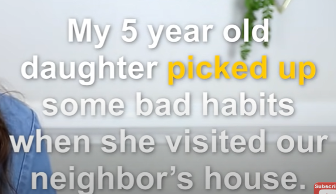
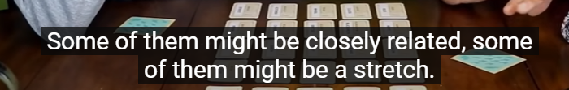
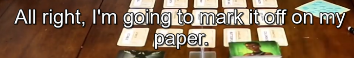
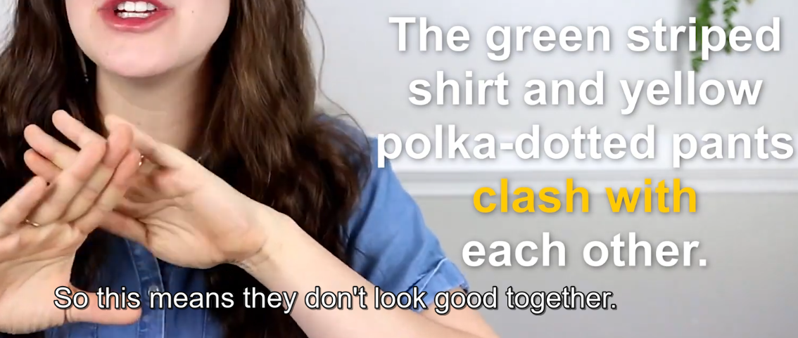
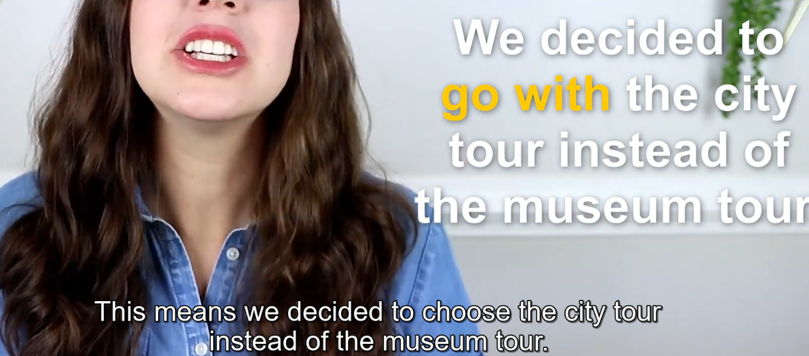
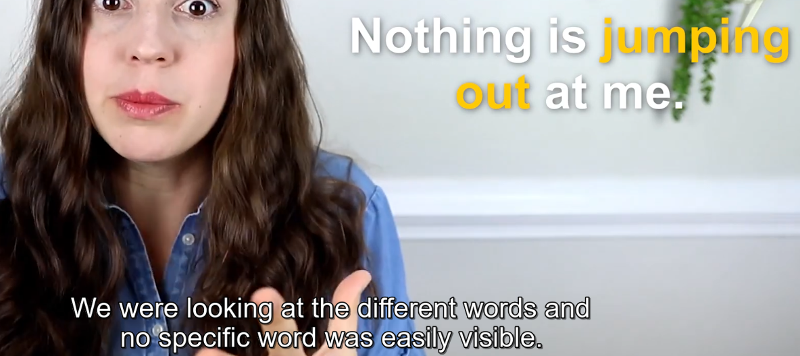

Vocabulary  词汇 

phrasal verb 短语动词

# 1 To Pick up 

学会,染上

 

你会学会的（你会在玩的过程中自然体会到，不需要刻意学习)

 

染上坏习惯

# 2 To be a  Stretch 

唐突,鲁莽,不切实际,离谱,八竿子打不着

单字意思： stretching 伸展,延申   stretching is the kind of exercise that you do before you go running 

 

我知道这听起来很鲁莽/唐突，但是你能接下来2周我不在的时候帮我遛狗吗

so you're already letting them know, i know is's a big deal , i know that this is a lot to ask you and you're adding that expression, i know that it's a   stretch 

 

要在下午3点就弄好这个报告似乎有点不切实际(很难,不是完全不可能,但是有点难)啊  

 

他们中有些含义非常近,有些可能八竿子打不着(牵强,远的离谱) 

# To Mark Off

it means you're noting something as completed .

It's the same as to check off something, you are marking it off 

 

to mark off sth 

to check off sth 

to cross off sth 

都是一样的意思 

i feel satisfield when i mark  off items from my to do list 

 

 

# To Give Away 

赠送；送出；背叛；泄露 ,透露一个秘密

 

 

to give away sth  透露某事

give it away 透露 

# To Clash With Sth

This means that it doesn't  go with  ,  it  goes against something 

和某物不搭，不协调 

 

means they don't look good together . 

They clash with each other 

# To Start Out With 

This is used when you're starting  a series  of events, So Other things are going to happen after that first event 

以...作为开始

 

 

当你要做面包时，你需要实现准备好所有原料

ingredients  成分;(尤指烹饪)原料;(成功的)因素，要素 

# To Be Lame 

lame通常是指某人不能行走。 但是这个短语里面它是指**不酷，不好** 

该短语很常见  means sth not very cool 

It's lame of me to do this 

Means not cool for me to do this 

 

所以如果有人和你说了一件很糗的事，很逊的事，很suck的事，你可以回复Wow,that's lame 

# To Go With Sth 

 chose sth 选择某事，做某事，着手干某事

餐馆场景

 

 

这个短语是 另一种选择某事的说法

# To Use Up 

This means to use something completely , nothing left 

 

# To Jump Out At 

this means it's just easy to see something  ，nothing is obvious 

显而易见的,很容易发现的 ，很突出

 

如果老师问你问题，你想不出这个问题的答案，你可以回答： Nothing jumped out at me , i have no idea what the answer is . 

so  it means sth on the  page is almost jumping out at you , so it's easily visible 

 

丹的头发很显而易见，所以他很容易被找到(发现) 

# 视频地址

 https://www.youtube.com/watch?v=yKrTY4AsB2c&list=PLKWcPfZiScgDf5Wc_Y5JZS17taUi2WWgx 

