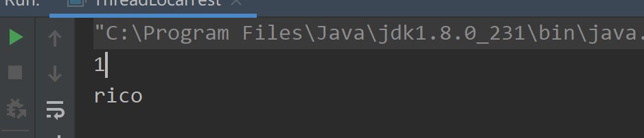
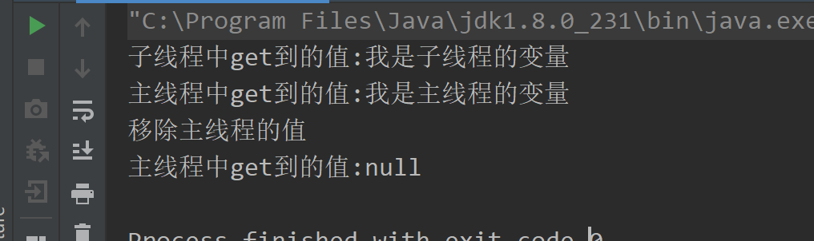
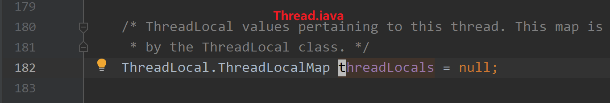
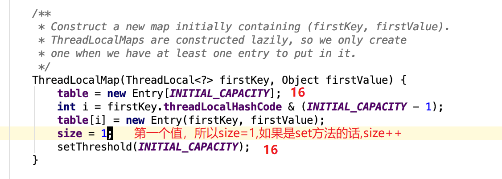
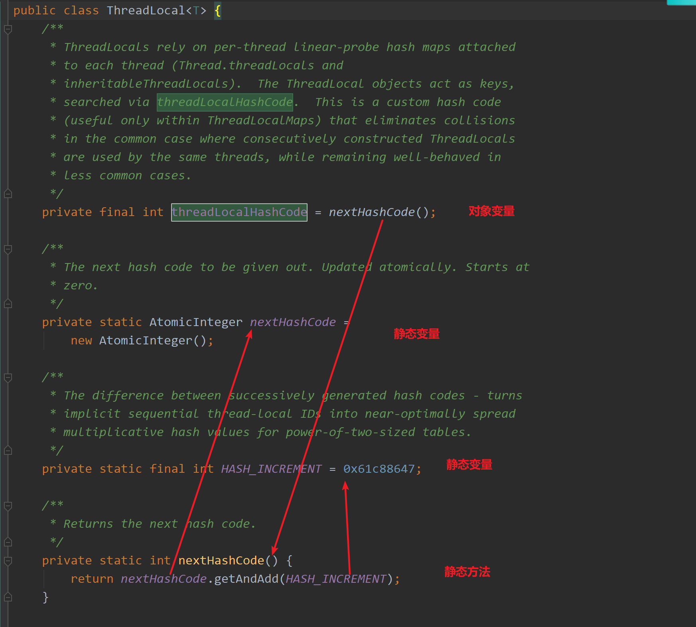
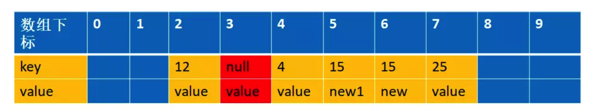

# 什么是ThreadLocal

 首先我们来看一下JDK1.8的文档介绍： 

```java
/**
 * This class provides thread-local variables.  These variables differ from
 * their normal counterparts in that each thread that accesses one (via its
 * {@code get} or {@code set} method) has its own, independently initialized
 * copy of the variable.  {@code ThreadLocal} instances are typically private
 * static fields in classes that wish to associate state with a thread (e.g.,
 * a user ID or Transaction ID).
 * 
 * <p>For example, the class below generates unique identifiers local to each
 * thread.
 * A thread's id is assigned the first time it invokes {@code ThreadId.get()}
 * and remains unchanged on subsequent calls.
 */
```

他的思想就是：给每一个使用到这个资源的线程都克隆一份，实现了不同线程使用不同的资源，且该资源之间相互独立

ThreadLocal提供了线程的局部变量，每个线程都可以通过`set()`和`get()`来对这个局部变量进行操作，但不会和其他线程的局部变量进行冲突，**实现了线程的数据隔离**。 

简要言之：往ThreadLocal中填充的变量属于**当前**线程，该变量对其他线程而言是隔离的。

**ThreadLocal提供一个线程局部变量，访问到某个变量的每一个线程都拥有自己的局部变量。说白了，ThreadLocal就是想在多线程环境下去保证成员变量的安全。**  

# 有什么用？

 ThreadLocal可以让我们拥有当前线程的变量，那这个作用有什么用呢？ 

## 管理Connection

最典型的是管理数据库的Connection：

**思考一个场景**：数据库连接的时候，我们会创建一个`Connection`连接，让不同的线程使用。这个时候就会出现多个线程争抢同一个资源的情况。


这种多个线程争抢同一个资源的情况，很常见，我们常用的解决办法也就两种：**空间换时间，时间换空间**

没有办法，鱼与熊掌不可兼得也。就如我们的`CAP`理论，也是牺牲其中一项，保证其他两项。

而针对上面的场景我们的解决办法如下：

- 空间换时间：为每一个线程创建一个连接。直接在线程工作中，创建一个连接。(**重复代码太多**)使用`ThreadLocal`，为每一个线程绑定一个连接。
- 时间换空间：对当前资源加锁，每一次仅仅存在一个线程可以使用这个连接。

通过`ThreadLocal`为每一个线程绑定一个指定类型的变量，相当于线程私有化 


当时在学JDBC的时候，为了方便操作写了一个简单数据库连接池，需要数据库连接池的理由也很简单，频繁创建和关闭Connection是一件非常耗费资源的操作，因此需要创建数据库连接池 

那么，数据库连接池的连接怎么管理呢？？我们交由ThreadLocal来进行管理。为什么交给它来管理呢？？ThreadLocal能够实现**当前线程的操作都是用同一个Connection，保证了事务！**

当时候写的代码：

```java
public class DBUtil {
    //DBCP数据库连接池
    private static BasicDataSource source;
    //为不同的线程管理连接
    private static ThreadLocal<Connection> local;
    static {
        try {
            //加载配置文件
            Properties properties = new Properties();
            //获取读取流
            InputStream stream = DBUtil.class.getClassLoader().getResourceAsStream("连接池/config.properties");
            //从配置文件中读取数据
            properties.load(stream);
            //关闭流
            stream.close();
            //初始化连接池
            source = new BasicDataSource();
            //设置驱动
            source.setDriverClassName(properties.getProperty("driver"));
            //设置url
            source.setUrl(properties.getProperty("url"));
            //设置用户名
            source.setUsername(properties.getProperty("user"));
            //设置密码
            source.setPassword(properties.getProperty("pwd"));
            //设置初始连接数量
            source.setInitialSize(Integer.parseInt(properties.getProperty("initsize")));
            //设置最大的连接数量
            source.setMaxActive(Integer.parseInt(properties.getProperty("maxactive")));
            //设置最长的等待时间
            source.setMaxWait(Integer.parseInt(properties.getProperty("maxwait")));
            //设置最小空闲数
            source.setMinIdle(Integer.parseInt(properties.getProperty("minidle")));
            //初始化线程本地
            local = new ThreadLocal<>();
        } catch (IOException e) {
            e.printStackTrace();
        }
    }

    public static Connection getConnection() throws SQLException {
        //从BasicDataSource池中获取连接
        Connection connection = source.getConnection(); 
        //把当前线程获取到的Connection放进ThreadLocal里面
        local.set(connection);
        //返回Connection对象
        return connection;
    }

    //关闭数据库连接
    public static void closeConnection() {
        //从threadlocal中拿到当前线程的Connection对象
        Connection connection = local.get();
        try {
            if (connection != null) {
                //恢复连接为自动提交
                connection.setAutoCommit(true);
                //这里不是真的把连接关了,只是将该连接归还给连接池
                connection.close();
                //既然连接已经归还给连接池了,ThreadLocal保存的Connction对象也已经没用了
                local.remove();
            }
        } catch (SQLException e) {
            e.printStackTrace();
        }
    }
}
```

## 避免一些参数传递

 日常中我们要去办理业务可能会有很多地方用到身份证，各类证件，每次我们都要掏出来很麻烦 

```java
	// 咨询时要用身份证，学生证，房产证等等....
    public void consult(IdCard idCard,StudentCard studentCard,HourseCard hourseCard){

    }

    // 办理时还要用身份证，学生证，房产证等等....
    public void manage(IdCard idCard,StudentCard studentCard,HourseCard hourseCard) {

    }
```

而如果用了ThreadLocal的话，ThreadLocal就相当于一个机构，ThreadLocal机构做了记录你有那么多张证件。用到的时候就不用自己掏了，问机构拿就可以了。

在咨询时的时候就告诉机构：来，把我的身份证、房产证、学生证通通给他。在办理时又告诉机构：来，把我的身份证、房产证、学生证通通给他。…

```java
// 咨询时要用身份证，学生证，房产证等等....
    public void consult(){
        threadLocal.get();
    }

    // 办理时还要用身份证，学生证，房产证等等....
    public void takePlane() {
        threadLocal.get();
    }
```


通过ThreadLocal的set()方法设置到线程的`ThreadLocal.ThreadLocalMap`里的是是线程自己要存储的对象，其他线程不需要去访问，也是访问不到的。各个线程中的`ThreadLocal.ThreadLocalMap`以及`ThreadLocal.ThreadLocal`中的值都是不同的对象。

# 怎么用

其实上面的数据库连接池中的代码已经部分展示了如何使用了 

```java
	ThreadLocal<Integer> threadLocal = new ThreadLocal<>();
    threadLocal.set(1);
    System.out.println(threadLocal.get());
	threadLocal.remove();

    ThreadLocal<String> threadLocal2 = new ThreadLocal<>();
    threadLocal2.set("rico");
    System.out.println(threadLocal2.get());
    threadLocal2.remove();
```

 

没错，这四行代码已经把`ThreadLocal`的使用方法表现得明明白白。

- `get`从`ThreadLocal`拿出一个当前线程所拥有得对象
- `set`给当前线程绑定一个对象
- `remove`将当前线程绑定的当前对象移除

案例2 


```java
public class ThreadLocalTest2 {
    public static void main(String[] args) throws InterruptedException {
        final ThreadLocal<String> threadLocal = new ThreadLocal<>();
        threadLocal.set("我是主线程的变量");
        Thread thread = new Thread(() -> {
            // 获取不到主线程设置的值，所以为null
            threadLocal.set("我是子线程的变量");
            System.out.println("子线程中get到的值:"+threadLocal.get());
        });
        // 启动子线程
        thread.start();
        thread.join(); //阻塞主线程,知道子线程执行完成
        // 获取到的是主线程设置的值，而不是子线程设置的
        System.out.println("主线程中get到的值:"+threadLocal.get());
        threadLocal.remove(); System.out.println("移除主线程的值");
        System.out.println("主线程中get到的值:"+threadLocal.get());
    }
}
```

 


**记住在使用的以后，一定要remove,一定要remove,一定要remove**

为什么要`remove`。相信不少小伙伴听到过`ThreadLocal`会导致内存泄漏问题。

没错，所以为了解决这种情况，所以用完就移除，别浪费空间 

看到这，脑袋上有好多问号出现了（**小朋友你是否有很多问号？**）

**为啥会引发内存泄漏？ ,为啥不remove就内存泄漏了,它是怎么将对象和线程绑定的,为啥get的时候 拿到的就是当前线程的而不是其他线程的,它怎么实现的？？？ ** 


用一个ThreadLocal也可以多次set一个数据，set仅仅表示的是线程的ThreadLocal.ThreadLocalMap中table的某一位置的value**被覆盖成你最新设置的那个数据而已，对于同一个ThreadLocal对象而言，set后，table中绝不会多出一个数据**。


1、ThreadLocal不是集合，它不存储任何内容，真正存储数据的集合在Thread中。**ThreadLocal只是一个工具，一个往各个线程的ThreadLocal.ThreadLocalMap中table的某一位置set一个值的工具而已** 

2、同步与ThreadLocal是解决多线程中数据访问问题的两种思路，**前者是数据共享的思路**，**后者是数据隔离的思路**  

3、同步是一种以时间换空间的思想，ThreadLocal是一种空间换时间的思想

# ThreadLocal实现

先来说一个思路：如果我们自己写一个`ThreadLocal` 会咋写？ 

线程绑定一个对象。这难道不是我们熟知的`map`映射？有了`Map`我们就可以以线程为`Key`,对象为`value`添加到一个集合中，然后各种`get,set,remove`操作，想怎么玩就怎么玩，搞定。

这时，有人说了。你这思路不对啊，你这一个线程仅仅只能存放一个类型的变量，那我想存多个呢



来吧，从源头考虑。现在我们的需求是：**线程可以绑定多个值，而不仅仅是一个**。嗯，没错，兄弟们把你们的想法说出来。



**让线程自己维护一个Map，将这个**`ThreadLocal`**作为**`Key`**,对象作为**`Value`**不就搞定了** 。其实jdk的ThreadLocal就是这么做的。 


此时，又人说了。按照你这样的做法，将`ThreadLocal`扔到线程本身的的Map里，那岂不是这个`ThreadLocal`**一直被线程对象引用，所以在线程销毁之前都是可达的，都无法**`GC`**呀，有**`BUG`**啊**？？？



**好，问题。**这样想，既然由于线程和`ThreadLocal`对象存在引用，导致无法`GC`，那我将你和线程之间的引用搞成弱引用或者软引用不就成了。一`GC`你就没了。


`JDK`中存在四种类型引用，默认是强引用，也就是我们经常干的事情。new对象。这个时候创建的对象都是强引用。



- 强引用。直接`new`
- 软引用。通过`SoftReference`创建，在内存空间不足的时候直接销毁，即它可能最后的销毁地点是在老年区
- 弱引用。通过`WeakReference`创建，在`GC`的时候直接销毁。即其销毁地点必定为伊甸区
- 虚引用。通过`PhantomReference`创建，它和不存也一样，**非常虚，只能通过引用队列在进行一些操作，主要用于堆外内存回收**


## ThreadLocal ,ThreadLocalMap 和Thread 的关系

这三者的关系由于大量的内部类的关系，第一次看的时候还是有点绕的 .建议先抛开内部类的关系，把每一个类当作普通类来看到，理解每個类的职责，最后再把内部类放进去考虑这样设计的目的。这里也给大家一个启示，面对复杂的事情的时候，我们需要跳出来，先把问题简单化，大方向把握了，再进一步去细化每一个功能点和设计的艺术


从上图我们可以发现**Thread 中持有一个ThreadLocalMap ** 


这里的ThreadLocalMap可以简单理解为就是持有一个数组（具体这个ThreadLocalMap我下面会详细介绍），这个数组是Entry 类型的。 Entry 的key 是ThreadLocal 类型的（就是你自己new出来的ThreadLocal），value 是Object 类型。一个ThreadLocalMap 可以持有多个ThreadLocal。他们是一对多的关系,就像上面的代码中我在一个线程中new了2个ThreadLocal,都可以获取到对应的值。 


不难看出ThreadLocalMap类是ThreadLocal类的静态内部类   而Entry是ThreadLocalMap的静态内部类，key是ThreadLocal（声明为弱引用），value是Object，也就是我们要存的值。 


## 为何ThreadLocalMap设计为ThreadLocal内部类

看到各种内部类是不是有点晕，为什么不独立ThreadLocalMap 出来呢？其实这里涉及到内部类起到封装的作用。来，我们看看源码的解析

```java
    /**
     * ThreadLocalMap is a customized hash map suitable only for
     * maintaining thread local values. No operations are exported
     * outside of the ThreadLocal class. The class is package private to
     * allow declaration of fields in class Thread.  To help deal with
     * very large and long-lived usages, the hash table entries use
     * WeakReferences for keys. However, since reference queues are not
     * used, stale entries are guaranteed to be removed only when
     * the table starts running out of space.
     */
    static class ThreadLocalMap {
    //这里省略其他属性和方法
    }
```

主要是说明ThreadLocalMap 是一个线程本地的值，它所有的方法都是private 的，也就意味着除了ThreadLocal 这个类，其他类是不能操作ThreadLocalMap 中的任何方法的，这样就可以对其他类是透明的。同时这个类的权限是包级别的，也就意味着只有同一个包下面的类才能引用ThreadLocalMap 这个类，这也是Thread 为什么可以引用ThreadLocalMap 的原因，因为他们在同一个包下面。

**虽然Thread 可以引用ThreadLocalMap，但是不能调用任何ThreadLocalMap 中的方法。这也就是我们平时都是通过ThreadLocal 来获取值和设置值**，看下以下代码

```java
public class Test {

    public static void main(String[] args) {
        ThreadLocal<String> local = new ThreadLocal<>();
        local.set("hello word");
        System.out.println(local.get());
    }
}
```

但我们调用ThreadLocal 的get 方法的时候，其实我们最后是通过调用ThreadLocalMap  来获取值的

```java
 public T get() {
        //这里通过获取当前的线程
        Thread t = Thread.currentThread();
        //通过线程来获取ThreadLocalMap ，还记得我们上面说的Thread 里面有一个ThreadLocalMap 属性吗？就是这里用上了
        ThreadLocalMap map = getMap(t);
        if (map != null) {
            ThreadLocalMap.Entry e = map.getEntry(this);
            if (e != null) {
                @SuppressWarnings("unchecked")
                T result = (T)e.value;
                return result;
            }
        }
        return setInitialValue();
    }
```


```java
ThreadLocalMap getMap(Thread t) {
        return t.threadLocals;//即Thread.java的threadLcoals，它是ThreadLcoal.ThreadLocalMap类型的
}
```

 


到这里，读者应该大概明白了，其实ThreadLdocalMap  对使用者来说是透明的，可以当作空气，我们一值使用的都是ThreadLocal，这样的设计在使用的时候就显得简单，然后封装性又特别好。

## ThreadLdocalMap何时与Thread 进行绑定(赋值)

在第一次调用ThreadLocal set() 方法的时候开始绑定的，来我们看下set 方法的源码

ThreadLoca.java

```java
    public void set(T value) {
        Thread t = Thread.currentThread();
        ThreadLocalMap map = getMap(t);
        if (map != null)
            map.set(this, value);
        else
        //第一次的时候进来这里，因为ThreadLocalMap还为null
            createMap(t, value);
    }
```


```java
 	//这个时候开始创建一个新的ThreadLocalMap 赋值给Thread 进行绑定
    void createMap(Thread t, T firstValue) {
        t.threadLocals = new ThreadLocalMap(this, firstValue);//this就是key,就是ThreadLocal对象
    }
```




 其中

```java
		/**
         * Set the resize threshold to maintain at worst a 2/3 load factor.
         */
        private void setThreshold(int len) {
            threshold = len * 2 / 3;
        }
```


Entry是Map中用来保存一个键值对的，而Map实际上就是多个Entry的集合。`Entry<key,value>` 和`Map<key,value>` 一样的理解方式就OK了 . Entry是Map实现类的内部类。看下HashMap实现源码，就明白Entry的作用了。 

createMap 方法只是在**第一次设置值的时候创建一个ThreadLocalMap 赋值给Thread 对象的threadLocals 属性进行绑定**，以后就可以直接通过这个属性获取到值了。

由于是第一次设值，肯定不用考虑地址冲突 。这里的`int i = firstKey.threadLocalHashCode & (INITIAL_CAPACITY - 1);` 下面会详细解读


举例

```java
public class Test {
    public static void main(String[] args) {
        ThreadLocal<String> local = new ThreadLocal<>();
        //设置值
        local.set("hello word");
        //获取刚刚设置的值
        System.out.println(local.get());
    }
}
```


值真正是放在ThreadLocalMap 中存取的，ThreadLocalMap 内部类有一个Entry 类，**key是ThreadLocal 对象**，value 就是你要存放的值，上面的代码value 存放的就是hello word。ThreadLocalMap 和HashMap的功能类似，但是实现上却有很大的不同：

1. HashMap 的数据结构是数组+链表
2. **ThreadLocalMap的数据结构仅仅是数组**
3. HashMap 是通过链地址法解决hash 冲突的问题
4. ThreadLocalMap 是通过**开放地址法来解决hash 冲突的问题**
5. HashMap 里面的Entry 内部类的引用都是强引用
6. ThreadLocalMap里面的Entry 内部类中的key 是弱引用，value 是强引用


## get方法


get方法其实就是set方法索引的逆向，根据key算出数组索引位置，把value返回出去

## 再谈三者关系

至此，我对ThreadLocal,ThreadLocalMap和Thread的关系有了更深的印象


ThreadLocalMap的key就是我们new出来的ThreadLocal对象, 一个Thread中可以有多个ThreadLocal(也即多个key,也就是可以set多个k-v), 

ThreadLocalMap其实是个数组,value的下标通过key哈希得到，数组该下标的位置存的就是value

该数组就是table,它是Entry的数组

```java
		/**
         * The table, resized as necessary.
         * table.length MUST always be a power of two. 长度必须是2的指数.具体为什么下面会解释
         */
        private Entry[] table;
```


entry的数据结构


## 为什么ThreadLocalMap 采用开放地址法来解决哈希冲突?

jdk 中大多数的类都是采用了链地址法来解决hash 冲突，为什么ThreadLocalMap 采用开放地址法来解决哈希冲突呢？首先我们来看看这两种不同的方式

### 链地址法

这种方法的基本思想是将所有哈希地址为 i 的元素构成一个称为同义词链的单链表，并将单链表的头指针存在哈希表的第i个单元中，因而查找、插入和删除主要在同义词链中进行。列如对于关键字集合{12,67,56,16,25,37, 22,29,15,47,48,34}，我们用前面同样的12为除数，进行除留余数法：


### 开放地址法（ **线性探测法** ）

 **人话就是：如果当前数组位有值，则判断下一个数组位是否有值，如果有值继续向下寻找，直到一个为空的数组位**  

这种方法的基本思想是**一旦发生了冲突，就去寻找下一个空的散列地址**(这非常重要，源码都是根据这个特性，必须理解这里才能往下走)，只要散列表足够大，空的散列地址总能找到，并将记录存入。

比如说，我们的关键字集合为{12,33,4,5,15,25},表长为10。 我们用散列函数f(key) = key mod l0。 当计算前S个数{12,33,4,5}时，都是没有冲突的散列地址，直接存入（蓝色代表为空的，可以存放数据）：


计算key = 15时，发现f(15) = 5，此时就与5所在的位置冲突。


于是我们应用上面的公式f(15) = (f(15)+1) mod 10 =6。于是将15存入下标为6的位置。这其实就是房子被人买了于是买下一间的作法：


### 链地址法和开放地址法的优缺点

开放地址法：

1. 容易产生堆积问题，不适于大规模的数据存储。
2. 散列函数的设计对冲突会有很大的影响，**插入时可能会出现多次冲突的现象**。
3. **删除的元素是多个冲突元素中的一个，需要对后面的元素作处理，实现较复杂**。

链地址法：

1. 处理冲突简单，且无堆积现象，平均查找长度短。
2. 链表中的结点是动态申请的，适合构造表不能确定长度的情况。
3. 删除结点的操作易于实现。只要简单地删去链表上相应的结点即可。
4. **指针需要额外的空间，故当结点规模较小时，开放定址法较为节省空间**。

### ThreadLocalMap 采用开放地址法原因

上面有讲到的ThreadLocalMap构造函数有一行代码如下，是计算数组下标的

`int i = firstKey.threadLocalHashCode & (INITIAL_CAPACITY - 1);`  

另一方面如果不是第一次，会调用set方法

```java
  private void set(ThreadLocal<?> key, Object value) {

            // We don't use a fast path as with get() because it is at
            // least as common to use set() to create new entries as
            // it is to replace existing ones, in which case, a fast
            // path would fail more often than not.

            Entry[] tab = table;
            int len = tab.length;
            int i = key.threadLocalHashCode & (len-1);
            略...
```

 也有计算地址的代码，逻辑就是**key.threadLocalHashCode和长度-1进行与与运算**

那么什么是key.threadLocalHashCode?

 

 注意实例变量`threadLocalHashCode`,  **每当创建`ThreadLocal`实例时这个值都会累加 `0x61c88647`**,   (它是在上一个被构造出的ThreadLocal的threadLocalHashCode的基础上加上一个魔数0x61c88647的，经过我debug代码发现确实是这样，也就是说你每new一个新的ThreadLocal,新的ThreadLocal拿到的threadLocalHashCode都不一样,在一个JVM实例中是不停累加的,因为nextHashCode是静态变量,跟随类的)   

**至于为什么每次new ThreadLocal都要累加？是因为新new一个ThreadLocal，意味着就有新的东西要加入到数组中了，那么去拿下标的时候数组位置肯定不能是原来那个，就需要累加，这样逻辑与出来的下标才不会是原来那个。** 


0x61c88647 是一个神奇的数字，让哈希码能均匀的分布在2的N次方的数组里(即` Entry[] table`)  

 `key.threadLocalHashCode & (len-1)`这么用是什么意思?  由于`table`数组的长度的大小必须是2的N次方 ，那 `len-1` 的二进制表示就是低位连续的N个1，那 `key.threadLocalHashCode & (len-1)` 的值就是 `threadLocalHashCode` 的低N位, 这样就能均匀的产生均匀的分布? 我用代码做个实验吧

```java
 public static void main(String[] args) {
        hash(16,10);
        hash(32,10);
    }

    static void hash(int range, int times){
        int a = 0x61c88647;
        int len = range -1;
        for ( int i = 0 ; i < times; i++) {
            System.out.print(i*a&len);
            System.out.print(",");
        }
        System.out.println();
    }
/*
输出
0,7,14,5,12,3,10,1,8,15
0,7,14,21,28,3,10,17,24,31,6,13,20,27,2,9,16,23,30,5
*/
```


产生的哈希码分布真的是很均匀，而且没有任何冲突啊, 太神奇了, [javaspecialists](http://www.javaspecialists.eu/archive/Issue164.html)中的一篇文章有对它的一些描述：

> This number represents the **golden ratio** (sqrt(5)-1) times two to the power of 31 ((sqrt(5)-1) * (2^31)). The result is then a golden number, either 2654435769 or -1640531527.

以及

> We established thus that the `HASH_INCREMENT` has something to do with fibonacci hashing, using the golden ratio. If we look carefully at the way that hashing is done in the `ThreadLocalMap`, we see why this is necessary. The standard `java.util.HashMap` uses linked lists to resolve clashes. The `ThreadLocalMap`simply looks for the next available space and inserts the element there. It finds the first space by bit masking, thus only the lower few bits are significant. If the first space is full, it simply puts the element in the next available space. The `HASH_INCREMENT` spaces the keys out in the sparce hash table, so that the possibility of finding a value next to ours is reduced.

这与斐波那契散列法以及黄金分割有关 


ThreadLocal 往往存放的数据量不会特别大（而且key 是弱引用又会被垃圾回收，及时让数据量更小），这个时候开放地址法简单的结构会显得更省空间，同时数组的查询效率也是非常高，加上第一点的保障，冲突概率也低

PS: 这里只有在new ThreadLocal的时候,threadLocalHash才会实例化，才会调用nextHashCode方法,而如果仅仅是获取threadLocalHash的值时，并不会调用nextHashCode方法。 

## 弱引用

我们看看ThreadLocalMap 中的存放数据的内部类Entry 的实现源码

```java
        static class Entry extends WeakReference<ThreadLocal<?>> {
            /** The value associated with this ThreadLocal. */
            Object value;

            Entry(ThreadLocal<?> k, Object v) {
                super(k);
                value = v;
            }
        }
```

我们可以知道Entry 的key 是一个弱引用，也就意味这可能会被垃圾回收器回收掉

```java
threadLocal.get() == null
```

也就意味着被回收掉了


 ## set 方法

**set方法就是先找相同的key，找到了就替换，找不到就新增。**

```java
 private void set(ThreadLocal<?> key, Object value) {
            Entry[] tab = table;
            int len = tab.length;
            //计算数组的下标
            int i = key.threadLocalHashCode & (len-1);

           //注意这里结束循环的条件是e != null，这个很重要，还记得上面讲的开放地址法吗？忘记的回到上面看下，一定看懂才往下走，不然白白浪费时间
           //这里遍历的逻辑是，先通过hash 找到数组下标，然后寻找相等的ThreadLocal对象
           //找不到就往下一个index找，有两种可能会退出这个循环
           // 1.找到了相同ThreadLocal对象
           // 2.一直往数组下一个下标查询，直到下一个下标对应的是null 跳出
            for (Entry e = tab[i];e != null;e = tab[i = nextIndex(i, len)]) {
                ThreadLocal<?> k = e.get();
                //如果找到直接设置value 值返回，这个很简单没什么好讲的
                if (k == key) {
                    e.value = value;
                    return;
                }

               // k==null&&e!=null 说明key被垃圾回收了，这里涉及到弱引用，接下来讲
                if (k == null) {
                    //key被回收的话就需要交换掉过期过期的值，并把新的值放在这里返回 具体下面会讲
                    replaceStaleEntry(key, value, i);
                    return;
                }
            }
            //来到这里，说明没找到,新增
            tab[i] = new Entry(key, value);
            int sz = ++size;
     		//清除一些失效的Entity
            if (!cleanSomeSlots(i, sz) && sz >= threshold)
              //进行扩容，这里先不讲
                rehash();
        }
```


还是拿上面解释开放地址法解释的例子来说明下。 比如说，我们的关键字集合为{12,33,4,5,15,25},表长为10。 我们用散列函数f(key) = key mod l0。 当计算前S个数{12,33,4,5,15,25}时，并且此时key=3,k=5 已经过期了（蓝色代表为空的，可以存放数据，红色代表key 过期，过期的key为null）：


这时候来了一个新的数据，key=15,value=new,通过计算f(15)=5,此时5已经过期，进入到下面这个if 语句


```java
    if (k == null) {
    //key 过期了，要进行替换
        replaceStaleEntry(key, value, i);
        return;
     }
```

## replaceStaleEntry 方法

这个方法在set中被调用, 就是当set某个值的时候，**查到它的key被回收了**，就需要替换掉过期的值，把新的值放在这里返回

```java
 private void replaceStaleEntry(ThreadLocal<?> key, Object value,int staleSlot) {
            Entry[] tab = table;
            int len = tab.length;
            Entry e;

            //这里采用的是从当前的staleSlot 位置向前面遍历，i--
            //这样的话是为了把前面所有的的已经被垃圾回收的也一起释放空间出来
            //(注意这里只是key 被回收，value还没被回收，entry更加没回收，所以需要让他们回收），
            //同时也避免这样存在很多过期的对象的占用,导致这个时候刚好来了一个新的元素达到阀值而触发一次新的rehash
            int slotToExpunge = staleSlot;
            for (int i = prevIndex(staleSlot, len);
                 (e = tab[i]) != null;
                 i = prevIndex(i, len))
                 //slotToExpunge 记录staleSlot左手边第一个空的entry 到staleSlot 之间key过期最小的index
                if (e.get() == null)
                    slotToExpunge = i;

            // 这个时候是从数组下标小的往下标大的方向遍历，i++，刚好跟上面相反。
            //这两个遍历就是为了在左边遇到的第一个空的entry到右边遇到的第一空的 entry之间查询所有过期的对象。
            //注意：在右边如果找到需要设置值的key（这个例子是key=15）相同的时候就开始清理，然后返回，不再继续遍历下去了，不理解的话看下面的图
            for (int i = nextIndex(staleSlot, len);
                 (e = tab[i]) != null;
                 i = nextIndex(i, len)) {
                ThreadLocal<?> k = e.get();
                //说明之前已经存在相同的key,所以需要替换旧的值并且和前面那个过期的对象的进行交换位置，
                //交换的目的下面会解释
                if (k == key) {
                    e.value = value;

                    tab[i] = tab[staleSlot];
                    tab[staleSlot] = e;

                    //这里的意思就是前面的第一个for 循环(i--)往前查找的时候没有找到过期的，只有staleSlot
                    // 这个过期，由于前面过期的对象已经通过交换位置的方式放到index=i上了，
                    // 所以需要清理的位置是i,而不是传过来的staleSlot
                    if (slotToExpunge == staleSlot)
                        slotToExpunge = i;
                        //进行清理过期数据
                    cleanSomeSlots(expungeStaleEntry(slotToExpunge), len);
                    return;
                }

                // 如果我们在第一个for 循环(i--) 向前遍历的时候没有找到任何过期的对象
                // 那么我们需要把slotToExpunge 设置为向后遍历(i++) 的第一个过期对象的位置
                // 因为如果整个数组都没有找到要设置的key 的时候，该key 会设置在该staleSlot的位置上
                //如果数组中存在要设置的key,那么上面也会通过交换位置的时候把有效值移到staleSlot位置上
                //综上所述，staleSlot位置上不管怎么样，存放的都是有效的值，所以不需要清理的
                if (k == null && slotToExpunge == staleSlot)
                    slotToExpunge = i;
            }

            // 如果key 在数组中没有存在，那么直接新建一个新的放进去就可以
            tab[staleSlot].value = null;
            tab[staleSlot] = new Entry(key, value);

            // 如果有其他已经过期的对象，那么需要清理他
            if (slotToExpunge != staleSlot)
                cleanSomeSlots(expungeStaleEntry(slotToExpunge), len);
        }
```

**第一个for 循环是向前遍历数据的，直到遍历到空的entry 就停止**（这个是根据开放地址的线性探测法）,这里的例子就是遍历到index=1就停止了。向前遍历的过程同时会找出过期的key,这个时候找到的是下标index=3 的为过期，进入到

```java
if (e.get() == null)
   slotToExpunge = i;
```

注意此时slotToExpunge=3，staleSlot=5


第二个for 循环是从index=staleSlot开始，向后遍历的,也是直到空的entry为止，找出是否有和当前匹配的key,有的话进行清理过期的对象和重新设置当前的值。这个例子遍历到index=6 的时候，匹配到key=15的值，进入如下代码

PS：注意往前找和往后找，做的事情也不一样。 往前找是为了清理对象。 往后找不单单为了清理对象，还为了找相同key的对象。 因为开放地址法的原因。 

```java
            if (k == key) {//如果key相同,说明找到需要交换的了
                    e.value = value;

                    tab[i] = tab[staleSlot];
                    tab[staleSlot] = e;

                    // Start expunge at preceding stale entry if it exists
                    if (slotToExpunge == staleSlot)
                        slotToExpunge = i;
                    cleanSomeSlots(expungeStaleEntry(slotToExpunge), len);
                    return;
         }
```

先进行数据交换，注意此时slotToExpunge=3，staleSlot=5，i=6。这里就是把5 和6 的位置的元素进行交换，**并且设置新的value=new**,交换后的图是这样的 


所以replaceStaleEntry 方法的作用用一句话总结就是交换并替换新值

### 为什么要交换

这里解释下为什么交换， 目前是这样的。 

 

我们先来看看如果不交换的话，经过设置值和清理过期对象，会是以下这张图。 把第5个清理了。 key为15的由于之前第5个被占了就到第6个去了


这个时候如果我们再一次设置一个key=15,value=new2 的值，通过f(15)=5,这个时候由于上次index=5是过期对象，被清空了，所以可以存在数据，那么就直接存放在这里了



你看，这样整个数组就存在两个key=15 的数据了，这样是不允许的，所以一定要交换数据. 之后才会避免这种情况


## get 方法

```java
public T get() {
        //获取当前线程
        Thread t = Thread.currentThread();
        //拿到当前线程的Map
        ThreadLocalMap map = getMap(t);
        if (map != null) {
            //获取这个实体
            ThreadLocalMap.Entry e = map.getEntry(this);
            if (e != null) {
                @SuppressWarnings("unchecked")
                T result = (T)e.value;
                //返回
                return result;
            }
        }
        return setInitialValue();
    }

	private Entry getEntry(ThreadLocal<?> key) {
        	//计算数组下标
            int i = key.threadLocalHashCode & (table.length - 1);
            Entry e = table[i];
        	//如果当前数组有值，且数组位的key相同，则返回value
            if (e != null && e.get() == key)
                return e;
            else
                //线性探测寻找对应的Key
                return getEntryAfterMiss(key, i, e);
        }

	private Entry getEntryAfterMiss(ThreadLocal<?> key, int i, Entry e) {
            Entry[] tab = table;
            int len = tab.length;

            while (e != null) {
                ThreadLocal<?> k = e.get();
                if (k == key)
                    return e;
                if (k == null)
                    //排除当前为空的Entity
                    expungeStaleEntry(i);
                else
                    //获取下一个数组位
                    i = nextIndex(i, len);
                e = tab[i];
            }
        //如果没有找到直接返回空
            return null;
        }
```

## remove 方法

```java
	public void remove() {
         ThreadLocalMap m = getMap(Thread.currentThread());
         if (m != null)
             m.remove(this);
     }

	private void remove(ThreadLocal<?> key) {
            Entry[] tab = table;
            int len = tab.length;
            int i = key.threadLocalHashCode & (len-1);
        //拿到当前的数组，判断是否为需要的数组位，如果不是线性查找
            for (Entry e = tab[i];
                 e != null;
                 e = tab[i = nextIndex(i, len)]) {
                if (e.get() == key) {
                    e.clear();
                    //清空位NUll的实体
                    expungeStaleEntry(i);
                    return;
                }
            }
        }
```

 我们可以看到一个现象：在`set`,`get`,`remove`的时候都调用了`expungeStaleEntry`来将**所有失效的**`Entity`移除 , 看一下这个方法做了什么 

```java
private int expungeStaleEntry(int staleSlot) {
            Entry[] tab = table;
            int len = tab.length;

            // 删除实体的Value
            tab[staleSlot].value = null;
    		//置空这个数组位
            tab[staleSlot] = null;
    		//数量减一
            size--;

            // 重新计算一次哈希，如果当前数组位不为null，线性查找直到找到一个null
            Entry e;
            int i;
            for (i = nextIndex(staleSlot, len);
                 (e = tab[i]) != null;
                 i = nextIndex(i, len)) {
                ThreadLocal<?> k = e.get();
                if (k == null) {
                    e.value = null;
                    tab[i] = null;
                    size--;
                } else {
                    int h = k.threadLocalHashCode & (len - 1);
                    if (h != i) {
                        tab[i] = null;

                        // Unlike Knuth 6.4 Algorithm R, we must scan until
                        // null because multiple entries could have been stale.
                        while (tab[h] != null)
                            h = nextIndex(h, len);
                        tab[h] = e;
                    }
                }
            }
            return i;
        }
```

## expungeStaleEntry

```java
        private int expungeStaleEntry(int staleSlot) {
            Entry[] tab = table;
            int len = tab.length;

            tab[staleSlot].value = null;
            tab[staleSlot] = null;
            size--;
            Entry e;
            int i;
            for (i = nextIndex(staleSlot, len);
                 (e = tab[i]) != null;
                 i = nextIndex(i, len)) {
                ThreadLocal<?> k = e.get();
                if (k == null) {
                //这里设置为null ,方便让GC 回收
                    e.value = null;
                    tab[i] = null;
                    size--;
                } else {
                //这里主要的作用是由于采用了开放地址法，所以删除的元素是多个冲突元素中的一个，需要对后面的元素作
                //处理，可以简单理解就是让后面的元素往前面移动
                //为什么要这样做呢？主要是开放地址寻找元素的时候，遇到null 就停止寻找了，你前面k==null
                //的时候已经设置entry为null了，不移动的话，那么后面的元素就永远访问不了了，下面会画图进行解释说明

                    int h = k.threadLocalHashCode & (len - 1);
                    //他们不相等，说明是经过hash 是有冲突的
                    if (h != i) {
                        tab[i] = null;

                        while (tab[h] != null)
                            h = nextIndex(h, len);
                        tab[h] = e;
                    }
                }
            }
            return i;
        }


```

接下来我们详细模拟下整个过程 根据我们的例子，key=5,15,25 都是冲突的，并且k=5的值已经过期，经过replaceStaleEntry 方法，在进入expungeStaleEntry 方法之前，数据结构是这样的


此时传进来的参数staleSlot=6，

```java
 if (k == null) {
                //这里设置为null ,方便让GC 回收
                    e.value = null;
                    tab[i] = null;
                    size--;
                }
```

这个时候会把index=6设置为null,数据结构变成下面的情况


 

接下来我们会遍历到i=7，经过int h = k.threadLocalHashCode & (len - 1) (实际上对应我们的举例的函数int h= f(25)); 得到的h=5,而25实际存放在index=7 的位置上，这个时候我们需要从h=5的位置上重新开始编列，直到遇到空的entry 为止


```java
                    int h = k.threadLocalHashCode & (len - 1);
                    if (h != i) {
                        tab[i] = null;

                        while (tab[h] != null)
                            h = nextIndex(h, len);
                        tab[h] = e;
                    }
```

这个时候h=6，并把k=25 的值移到index=6 的位置上，同时设置index=7 为空，如下图


 


其实目的跟replaceStaleEntry 交换位置的原理是一样的，为了防止由于回收掉中间那个冲突的值，导致后面冲突的值没办法找到（因为e==null 就跳出循环了）

## cleanSomeSlots

 回到上面那个replaceStaleEntry 方法中的以下代码片段 `

```java
  if (k == key) {
                    e.value = value;
 
                    tab[i] = tab[staleSlot];
                    tab[staleSlot] = e;
 
                    // Start expunge at preceding stale entry if it exists
                    if (slotToExpunge == staleSlot)
                        slotToExpunge = i;
                    //执行清理
                    cleanSomeSlots(expungeStaleEntry(slotToExpunge), len);
                    return;
                }
```

 刚刚上面执行完expungeStaleEntry 后，会执行cleanSomeSlots 这个方法 

```java
//这个方法是从i 开始往后遍历（i++）,寻找过期对象进行清除操作
 private boolean cleanSomeSlots(int i, int n) {
            boolean removed = false;
            Entry[] tab = table;
            int len = tab.length;
            // 用do while 语法，保证 do 里面的代码至少被执行一次
            do {
                i = nextIndex(i, len);
                Entry e = tab[i];
                
                if (e != null && e.get() == null) {
                //如果遇到过期对象的时候，重新赋值n=len 也就是当前数组的长度
                    n = len;
                    removed = true;
                    //在一次调用expungeStaleEntry 来进行垃圾回收（只是帮助垃圾回收）
                    i = expungeStaleEntry(i);
                }
            } while ( (n >>>= 1) != 0);//无符号右移动一位，可以简单理解为除以2
            return removed;
        }
```

 经过上面的分析expungeStaleEntry 返回的值i=7,**传进来的n 是数组的长度n=10**; 大家可以看到这个方法的循环结束条件是n>>>1!=0,  **也就是这个方法在没有遇到过期对象的时候，会执行log2(n)的扫描**。这里没有选择扫描全部是为了性能的平衡。由于这里的跳出循环的条件不是遇到空的entry 就停止，那么空entry 后面的过期对象也有机会被清理掉（对应下图的index=9，会被清除），注意下标在i 前面的的过期对象也有机会被清理掉，只要是因为如果n>>>1!=0 的情况，并且i 已经是最大值了，调用以下代码会从下标为0 开始编列，所以对应下图的index=0 也会被清理掉 

```
		private static int nextIndex(int i, int len) {
            return ((i + 1 < len) ? i + 1 : 0);
        }
```

 

 为了解释，上图中的 index=0 和index =9 这个过期对象数据是临时加上去了，前面的分析没有这个对象，大家不要感到太唐突（临时加上为了解答问题 (这个整理的话每次是只整理一段区域的对象么，如果数组的结构呈现前中后三块区域的话，每次set()和get()的元素计算后都落在了中间区域，是不是前后的元素都不会被清理到啊？） 


通过上面的分析，我们知道`expungeStaleEntry()` 方法是帮助垃圾回收的，根据源码，我们可以发现 get 和set  方法都可能触发清理方法`expungeStaleEntry()`，**所以正常情况下是不会有内存溢出的 但是如果我们没有调用get 和set 的时候就会可能面临着内存溢出**，养成好习惯不再使用的时候调用remove(),加快垃圾回收，避免内存溢出

退一步说，就算我们没有调用get 和set 和remove 方法,线程结束的时候，也就没有强引用再指向ThreadLocal 中的ThreadLocalMap了，这样ThreadLocalMap 和里面的元素也会被回收掉，**但是有一种危险是，如果线程是线程池的， 在线程执行完代码的时候并没有结束，只是归还给线程池，这个时候ThreadLocalMap 和里面的元素是不会回收掉的**


# ThreadLocal内存泄漏原因

由于ThreadLocalMap是以弱引用的方式引用着ThreadLocal，换句话说，就是**ThreadLocal是被ThreadLocalMap以弱引用的方式关联着，因此如果ThreadLocal没有被ThreadLocalMap以外的对象引用，则在下一次GC的时候，ThreadLocal实例就会被回收，那么此时ThreadLocalMap里的一组KV的K就是null**了，因此在没有额外操作的情况下，此处的V便不会被外部访问到，而且**只要Thread实例一直存在，Thread实例就强引用着ThreadLocalMap，因此ThreadLocalMap就不会被回收，那么这里Key为null的Value就一直占用着内存**。

综上，发生内存泄露的条件是

- ThreadLocal实例没有被外部强引用，比如我们假设在提交到线程池的task中实例化的ThreadLocal对象，当task结束时，ThreadLocal的强引用也就结束了
- ThreadLocal实例被回收，但是在ThreadLocalMap中的V没有被任何清理机制有效清理
- 当前Thread实例一直存在，则会一直强引用着ThreadLocalMap，也就是说ThreadLocalMap也不会被GC

**也就是说，如果Thread实例还在，但是ThreadLocal实例却不在了** (ThreadLocal可在Thread外面实例化,和Thread无关,所以会存在Thread还在,ThreadLocal不在的情况)，则ThreadLocal实例作为key所关联的value无法被外部访问，却还被强引用着，因此出现了内存泄露。

之所以有关于内存泄露的讨论是因为在有线程复用如线程池的场景中，一个线程的寿命很长，大对象长期不被回收影响系统运行效率与安全。如果线程不会复用，用完即销毁了也不会有ThreadLocal引发内存泄露的问题


也就是说，我们回答了文章开头的第一个问题，ThreadLocal如果使用的不当，是有可能引起内存泄露的，虽然触发的场景不算很容易。


# ThreadLocal在预防内存泄漏方面，做了哪些努力？

Thread中维护了ThreadLocalMap，**所以ThreadLocalMap的生命周期和Thread（当前线程）一样长**。使用不当就可能会导致内存泄漏问题。但是，在ThreadLocal中，进行set操作的时候会清除Map里所有key为null的value。 


 

 这是java8中ThreadLocal.set()方法，for循环是遍历整个Entry数组，红色框的地方是碰到了(null,value)的处理逻辑，也就是碰到了内存泄漏后会将原来的Entry替换掉避免内存泄漏。 

# ThreadLocal内存泄漏避免方案


当我们仔细读过ThreadLocalMap的源码，我们可以推断，如果在使用的ThreadLocal的过程中，显式地进行remove是个很好的编码习惯，这样是不会引起内存泄漏。

如果您必须使用ThreadLocal，请确保在您完成该操作后立即删除该值，并且最好在将线程返回到线程池之前。 最佳做法是使用remove（）而不是set（null），因为这将导致WeakReference立即被删除，并与值一起被删除。


 # ThreadLocal使用建议

当需要存储线程私有变量的时候，可以考虑使用ThreadLocal来实现

当需要实现线程安全的变量时，可以考虑使用ThreadLocal来实现

当需要减少线程资源竞争的时候，可以考虑使用ThreadLocal来实现

注意Thread实例和ThreadLocal实例的生存周期，因为他们直接关联着存储数据的生命周期 


如果频繁的在线程中new ThreadLocal对象，在使用结束时，最好调用ThreadLocal.remove来释放其value的引用，避免在ThreadLocal被回收时value无法被访问却又占用着内存


# 参考 

https://xie.infoq.cn/article/eb09a8ddb6df4edf1505fa81c

https://blog.csdn.net/qq_45401061/article/details/103101719