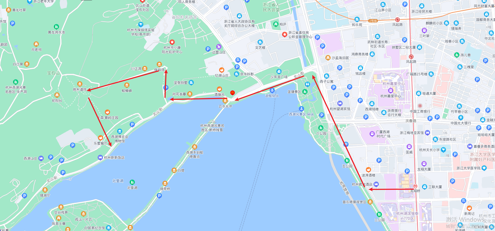
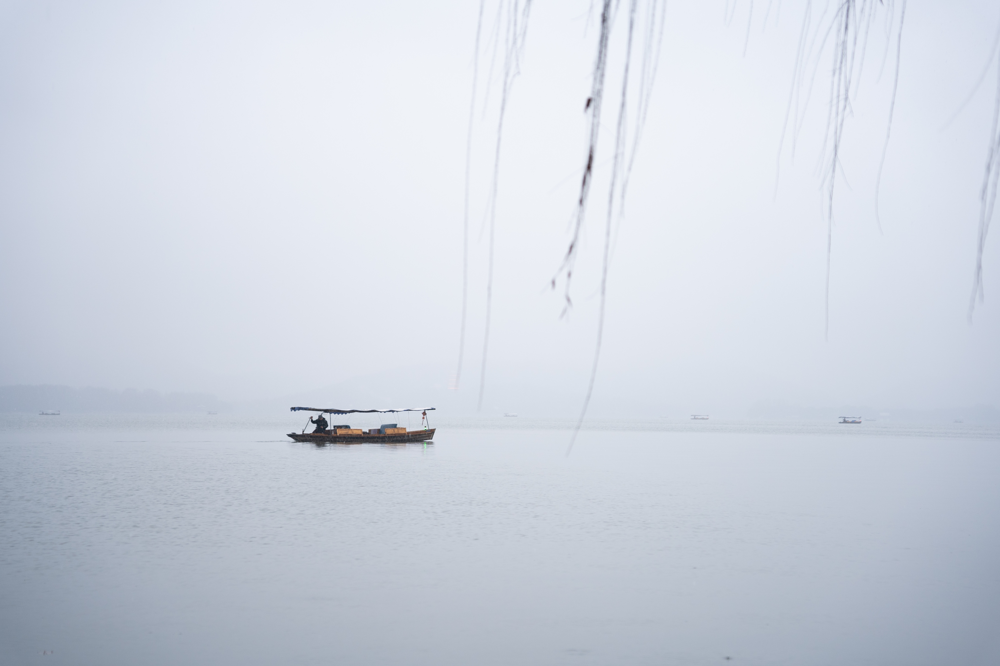
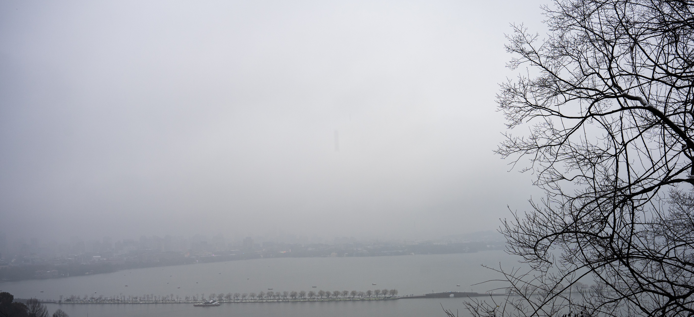
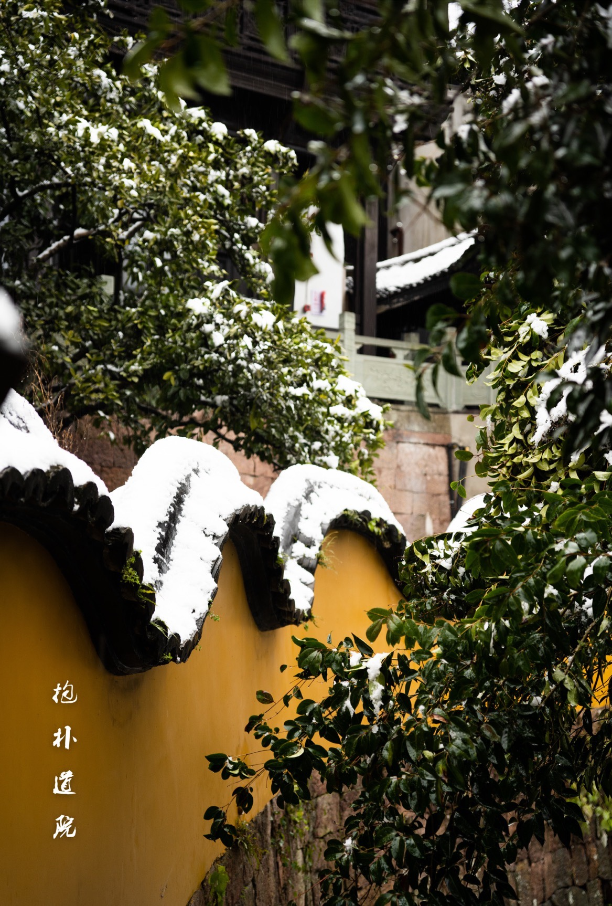

### 缘起

壬寅年正月初七，杭州大雪，此真谓可遇不可求，记得上次杭州下雪还是在三年之前。 于是约上好友去西湖赏雪 

### 路线

地铁: `龙翔桥地铁站 ~ 徒步到断桥 ~ 上宝石山 ~ 抱朴道院 ~ 原路返回`

 


### 西湖雪景

只有来看过西湖的雪景，才明白明末诗人张岱在《湖心亭看雪》中所写的：

```
雾凇沆砀，天与云与山与水，上下一白。湖上影子，惟长堤一痕、湖心亭一点，与余舟一芥、舟中人两三粒而已
```


 


 


 


 


 


宋代欧阳修的《采桑子》有一句:何人解赏西湖好，佳景无时.写出了西湖，不管何时何季，西湖总能带给你不同的景色。一千个读眼中有一千个哈姆雷特,西湖亦是如此。


### 回家

不知不觉，从宝石山走回市区已是晚上，于是在天桥上拍了张车水马龙的长曝光


 


<video src = video.mp4></video>


最后到家的时候脚已经冻得冰冷，但是此行还是非常开心的。 