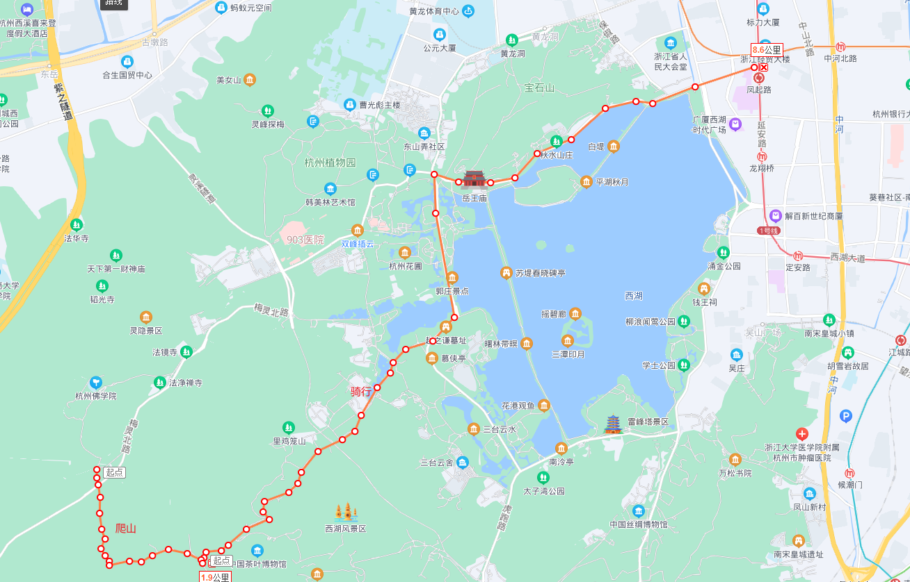
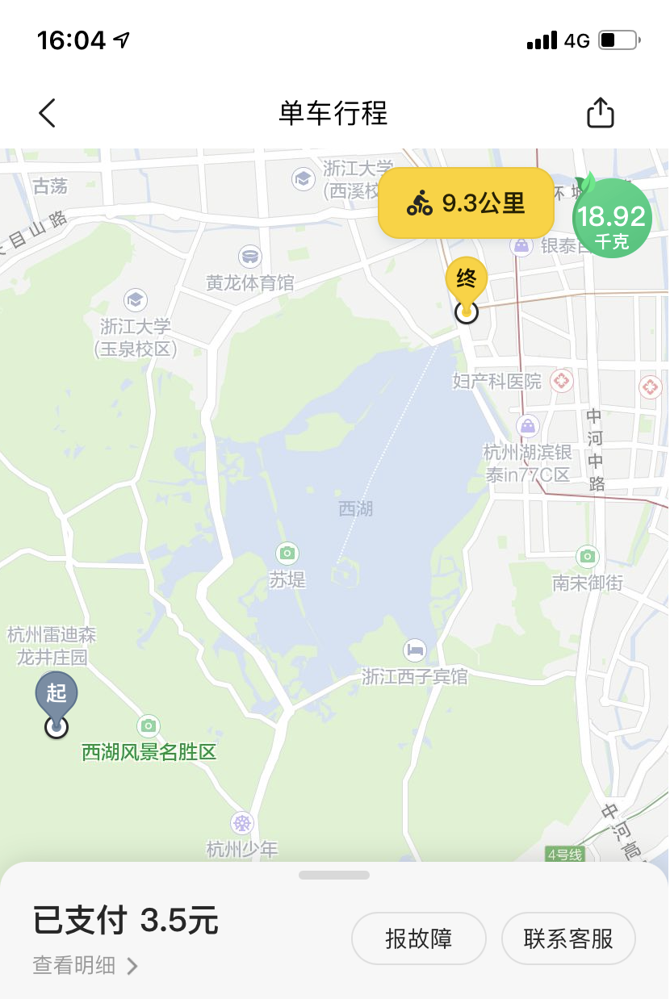

# 缘起

2022年3月12日，杭州进入了早春三月，天气宜人，遂决定去爬龙井产地，狮峰山。 

# 路线

打车到法喜寺，从法喜寺对面的入口上山，爬到狮峰。然后下山便到了龙井村。 总长约2公里。 

 

然后再从龙井村骑车绕西湖半圈，约10KM 

 


# 狮峰美景

 


 

 


 

 

 

 

 


每年的三四月份，是杭州最美的季节：西湖中水光潋滟，狮峰山新茶吐芽，断桥上游人如织。

在三月的杭州走一走，真是一番享受！ 


```
白居易《钱塘湖春行》

孤山寺北贾亭西，水面初平云脚低。

几处早莺争暖树，谁家新燕啄春泥。

乱花渐欲迷人眼，浅草才能没马蹄。

最爱湖东行不足，绿杨阴里白沙堤。
```


