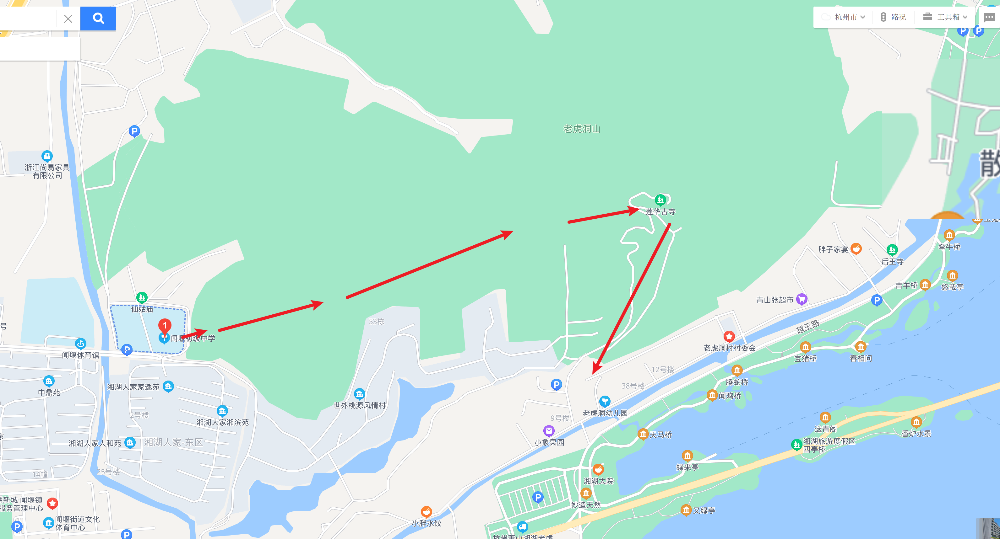
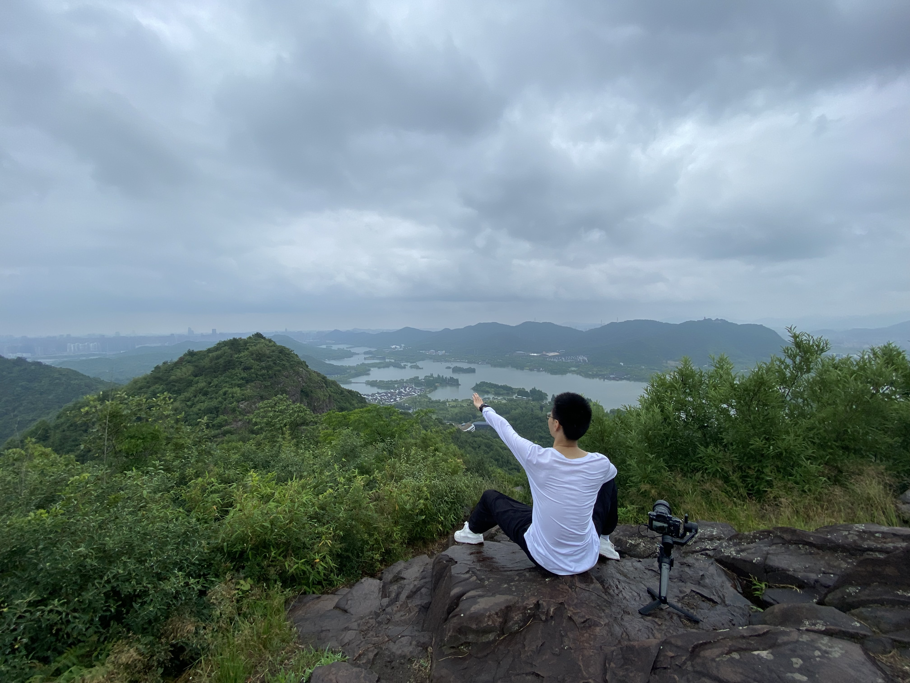

# 缘起

听闻附近的湘湖老虎洞山风景不错，忙碌于工作中没时间锻炼的我决定去爬下山运动一下。遂决定前往一探美景

# 路线

导航到杭州萧山闻堰初级中学，旁边有一条上山的小路，往上走就开始了老虎洞山的爬山之旅。

可以翻越老虎洞山，也可以半路从山上的莲花古寺下山。

 

# 老虎洞山美景

老虎洞上山没有台阶和铺装路面，沿着前人走出的泥石落叶小路拾级而上，就可以爬上山。许久没锻炼的我刚爬还有些气喘吁吁。

向上爬的过程还是挺艰辛，路隘林深苔滑，初极狭，才通人。复行数百步，半路遇雨，因想解放双手畅意拍摄，故去雨具，雨势渐大，但不觉狼狈。

此刻想起苏东坡的：“莫听穿林打叶声，何妨吟啸且徐行。竹杖芒鞋轻胜马，谁怕？一蓑烟雨任平生。” 真是应景

登至顶，豁然开朗。山上可以俯瞰整个湘湖，风景如画。春风料峭，回首向来萧瑟处，归去，也无风雨也无晴

爬完下山并不觉得累，反而觉得神清气爽，大概是山上植被茂盛，氧含量丰富的缘故吧。 

在忙碌的工作之余周末爬一座小山，欣赏美丽的自然风光，真是一番享受啊。

 

 

 

  

<video width="800" height="500" controls="controls">
    <source src="video2.mp4" type="video/mp4">
</video>

<video width="800" height="500" controls="controls">
    <source src="video3.mp4" type="video/mp4">
</video>

