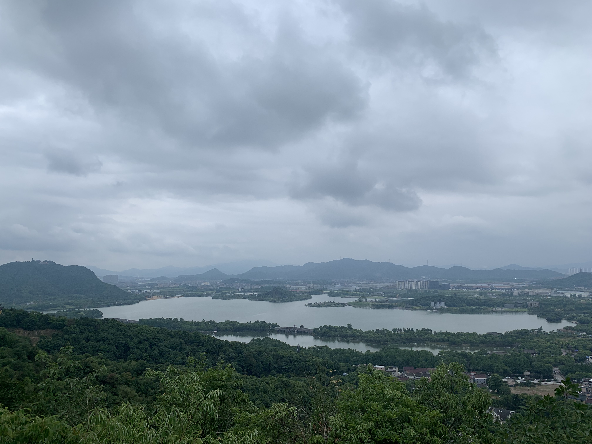

# 路线

导航到杭州萧山闻堰初级中学，旁边有一条上山的小路，往上走就开始了老虎洞山的爬山之旅。

可以翻越老虎洞山，也可以半路从山上的莲花古寺下山。

 

# 老虎洞山美景

老虎洞上山没有台阶和铺装路面，沿着前人走出的泥石落叶小路拾级而上，就可以爬上山，山上风景如画，可以俯瞰整个湘湖美景。

 

 

 

 

<video src = "video1.mp4" ></video> 

<video src = "video2.mp4"></video> 

<video src = "video3.mp4"></video>  

半路遇雨，因想解放双手畅意拍摄，故去雨具，雨势渐大，但不觉狼狈。

莫听穿林打叶声，何妨吟啸且徐行。竹杖芒鞋轻胜马，谁怕？一蓑烟雨任平生。

料峭春风吹酒醒，微冷，山头斜照却相迎。回首向来萧瑟处，归去，也无风雨也无晴。

爬完下山并不觉得累，反而觉得神清气爽，大概是山上植被茂盛，氧含量丰富。

