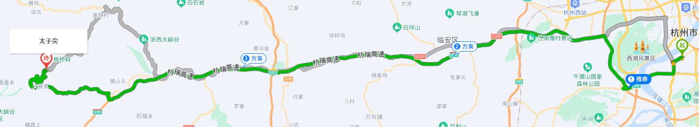
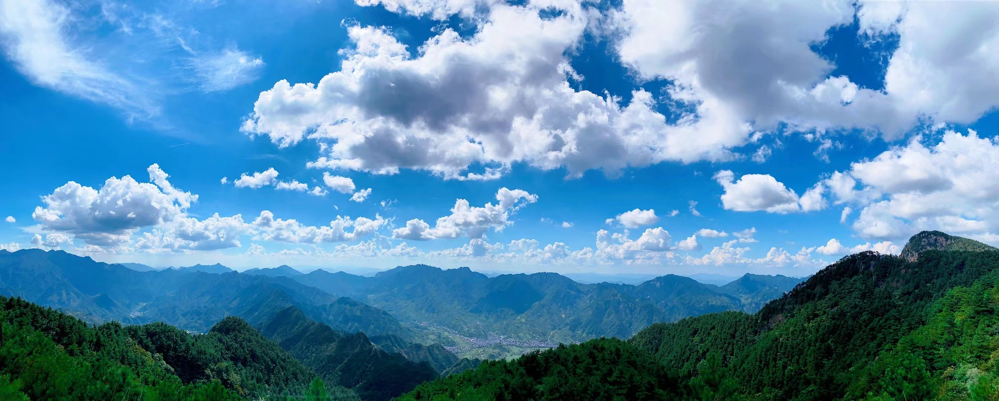
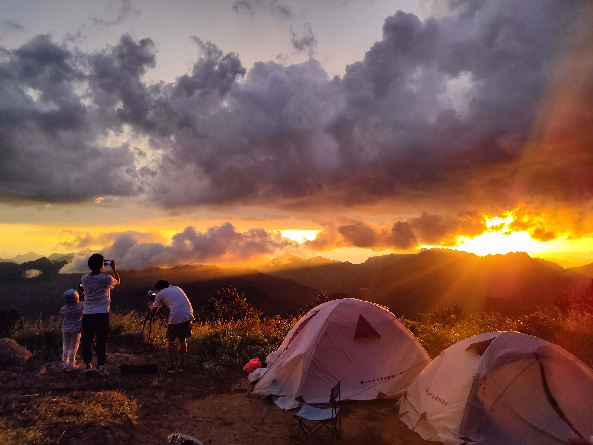
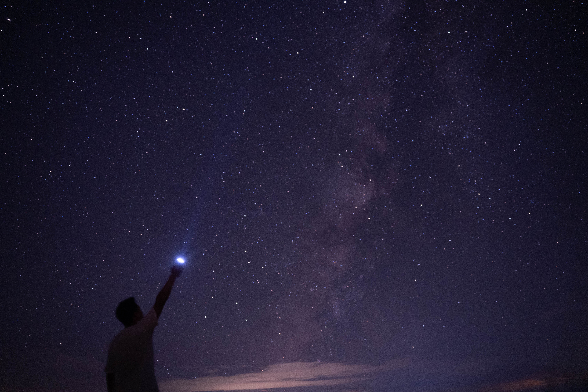

# 缘起

听闻太子尖可露营，且远离都市光污染少，晚上可以拍到银河，于是约上小伙伴自驾太子尖露营。 

# 路线

上午自驾从杭州市区出发，中午在龙岗镇吃中饭，买补给。然后上山

总花费大概三个半小时

 

# 装备

* 登山杖
* 烧水炉
* 四季帐篷，防潮垫，被子，凳子
* 食物（水，干粮，自热锅，米饭等)
* 墨镜（山上紫外线强烈，太阳大）
* 相机，三脚架，无人机

# 路途

开车上山，离太子尖很近的时候，已经被山上的美景吸引了，停车拍了些照片。 确实壮美

 

 

 

# 上山露营

到了山顶的平台，把车停好。山顶只能走上去，大概需要走半个多小时。由于没有台阶，且拿了好多东西，并不好走。

太阳又大，天气又闷，到了半山坡实在爬不动了，于是躲在树荫下休息了会儿之后，把帐篷支了起来。    

不一会儿，就看到了一片云海从脚下缓缓飘来，我们一群人兴奋的叫了起来

<video width="800" height="500" controls="controls">
    <source src="11.mp4" type="video/mp4">
</video

这个云海向我们扑来，转眼间，晴朗的天气就变成了狂风大雨，我们连忙躲进帐篷。大雨很快就不下了，时间也来到了傍晚，天空被夕阳染成了红色,于是我拍下了下面这张照片

 

然后支起三脚架拍了一段延时

<video width="800" height="500" controls="controls">
    <source src="12.mp4" type="video/mp4"> 
</video

入睡的时候，大雨又至，我们伴随着雨点打击着帐篷的声音入睡。

半夜，忽闻其他人叫了一声，星星！于是我们打开帐篷一看：天上繁星点点，于是立马困意全无。穿起衣服拿上三脚架和相机，拍星空。

来到帐篷外面，才发现，尽管是8月，但是半夜的1500米的山上，是真的冷。

但是这也阻挡不了拍星空的热情

 

 

# 第二天

拍完星空后，继续回帐篷睡觉。 第二天一早醒来后我们就下山准备回家了。下山途中由于道路石头多，还负重，脚崴了，后来去医院拍片发现跟骨骨左前缘撕脱性骨折。 :(

# 感受

这次太子尖露营，几乎是经历了四季的天气变化，晴天，雨天，多云。也几乎感受到了四季的温度变化。 见到了云海，晚霞，星空银河。要说遗憾的话就是下山的时候骨折了，然后第二天太困起不来看日出。 总体体验还是好的，希望以后能多多出去露营。