# 1、 入门简介

软件语言调整成中文,设置自动备份实时保存 

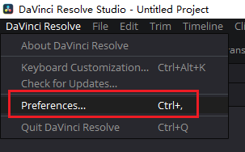 

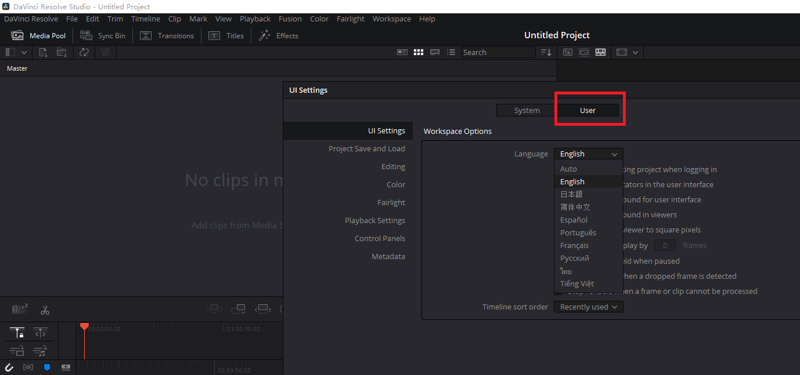  

 

软件下方有几个功能面板，对应的就是视频制作的从头到尾的流程 

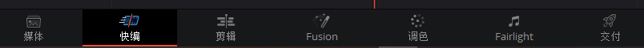 

## 媒体面板

  导入素材，分类 

 

备选素材从媒体浏览器中拖入媒体池  

可以在媒体池中创建媒体夹帮助分类 

 

达芬奇有个最大的问题，一旦导入素材，就无法更改项目的帧率。 所以在前期导入素材前，就把项目的帧率设置好 ,然后再导入素材 

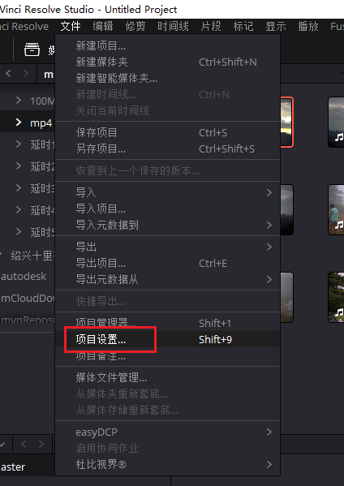    

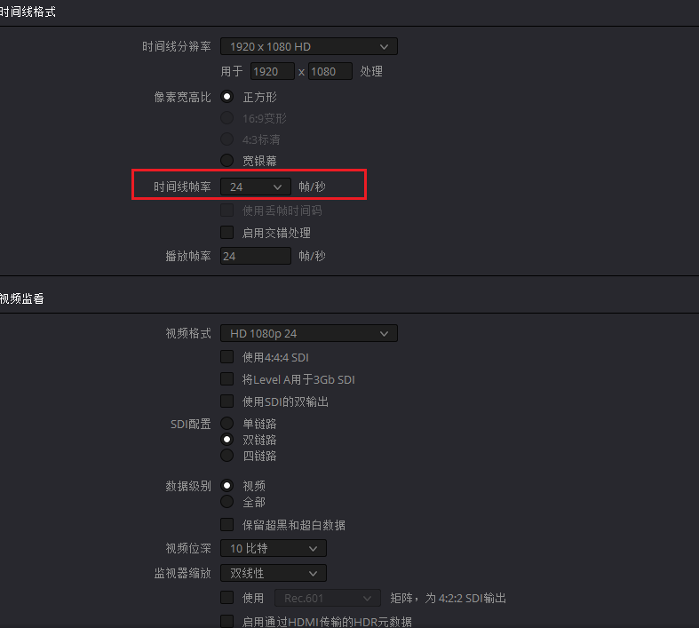   

导入素材后就可以开始剪辑，达芬奇有2个剪辑面板，快编和剪辑 ，这2者可以相互替代 。最常用的是剪辑面板 

## 剪辑面板 

剪辑面板 分为 5大块 

 

通常剪辑视频，我们会在媒体池进行筛选，随后在素材监视器通过 i 键 和 o键  打下出入点 ，然后把这段素材拖入时间线 ，进行拼凑和组装 

 

快编界面和剪辑界面很相似

## 调色

 

预设区可以保存调色预设或者是LUTS 

节点区是记录调色操作和效果的面板 

除了可以单纯的调色，还可以稳定，降噪，或者是跟踪 

## Fairlight 

对音频调整

## 交付

通常选择mp4 封装  H.264 编码 

# 2、剪辑面板

## 创建项目

达芬奇没有办法在导入素材以后改变项目的帧率，所以创建项目后做的第一件事就是点击文件-->项目设置-->更改帧率

在中国一般使用PAL制，25帧 。因为国内是50HZ，25帧能更好的规避屏闪

还要修改项目缓存的位置，否则C盘很快会被达芬奇占满  

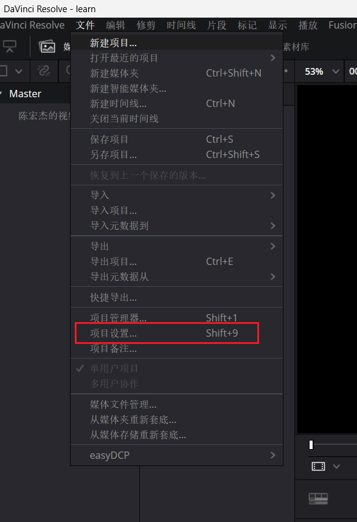 

 

**建议先导入所有素材，再在媒体池中创建媒体夹进行分类筛选，然后再在素材监视器进行素材的筛选** 

**建议先导入所有素材，再在媒体池中创建媒体夹进行分类筛选，然后再在素材监视器进行素材的筛选** 

**建议先导入所有素材，再在媒体池中创建媒体夹进行分类筛选，然后再在素材监视器进行素材的筛选** 

不要在媒体池就进行筛选，这是一个破坏性的操作。假如你再去寻找没有被导入的素材，就会非常麻烦 

通过i键和o键打视频的入点和出点，再拖入时间线

拖入时间线除了可以视频音频都拖入，也可以只拖入视频，音频

 

## 时间线 

可以直接拖入素材创建时间线，但是这样命名会很混乱， 建议在剪辑模块下，右击媒体池，创建时间线

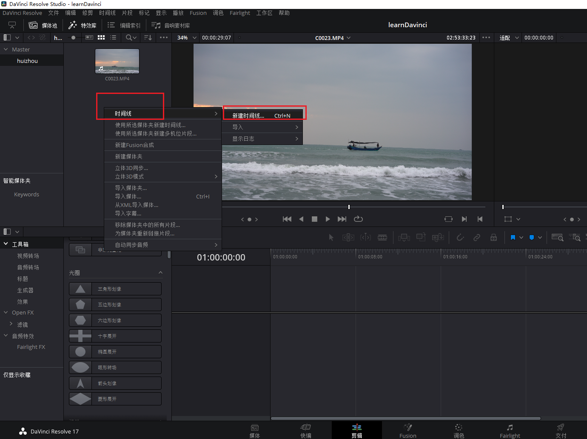 

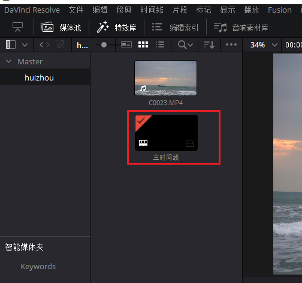 

达芬奇有多种浏览时间线的方法，可以通过点击时间线按钮来进行设置

 

 

简单视图可以显示更多轨道

 

**时间线缩放： 按住ALT 然后滚动鼠标滚轮进行时间线缩放**  

也可以按住Ctrl然后加减号进行时间线的缩放   

## 时间线 剪辑视频

把鼠标移动到素材的边缘，鼠标会有2种图标 

### 第一种图标

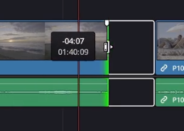 

这种可以让你通过拖动鼠标来快速剪辑素材。往左拖动，缩短视频，往右就是拉长视频。

点击2个素材中间的空挡，按Del按键可以将两个素材连贯到一起 

### 第二种图标

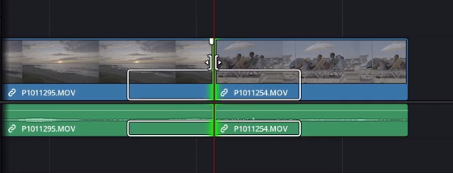 

这种图标的话，往左会把前面的视频缩短，右边的视频拉长。 往右则反之。直到其中一个素材达到最大长度才不能够延申 

## 时间线 工具栏

默认是选择模式，也就是普通模式

### 修剪编辑模式

按T或者点击如下按钮进入修剪编辑模式

 

在这种模式中，剪辑一段视频，这段视频后方的素材会跟着一起移动 （之前普通模式中需要手动对齐或删除空挡对齐） 

### 动态修剪模式

不常用 

快捷键 W 

回放的时候自动往回跳一点

### 刀片编辑模式

快捷键B

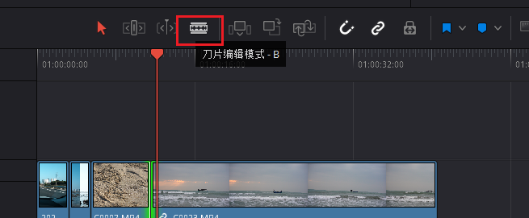 

激活这个模式之后，点击素材可以把一段素材一分为二 ，可以进行进一步的裁剪和处理

### 插入片段

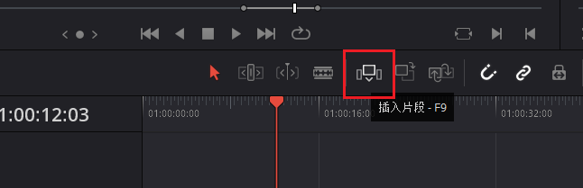 

点击后，你在媒体库中选中的素材就会插入到你当前时间线标尺所在的位置，后方的片段自动往后移

使用方法是先点击素材，再点击插入片段按钮，就会将你刚才点击是素材自动插入。后面的视频自动往后移动

### 覆盖

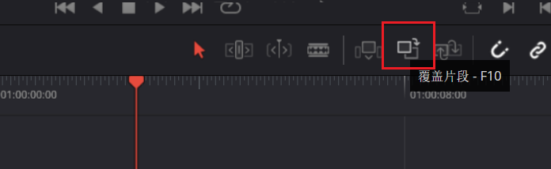 

新素材覆盖现有内容 

注意，红色指针在哪里就从哪里开始覆盖 ，如果在一段视频中间，就从中间开始覆盖。所以如果要整段覆盖，就把指针移到那段视频开头

### 替换

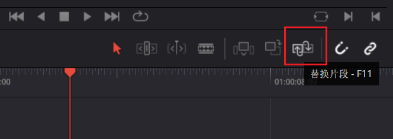 

自动替换现有片段,总时长和别的片段不受影响

注意，红色指针在哪里就从哪里开始替换 ，如果在一段视频中间，就从中间开始替换。所以如果要整段替换，就把指针移到那段视频开头

### 吸附

开启后，拖入素材自动吸附到时间线上的前一个素材后面。如果未开启，需要手动对齐 

所以99%的情况下我们都会激活这个效果 ,默认也是开启的

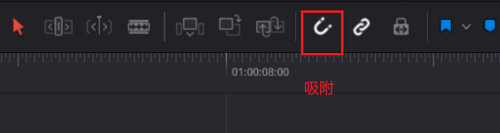 

### 音视频链接

当激活这个效果时，拖动视频，音频一起跟着动。拖动音频，视频也一起跟着动 。如果关闭，就是分开的  

默认是开启的

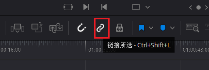 

假如前期只拖入了视频或音频，后期想把 对应 音频或者视频找找回来，可以在时间轴上把当前时间轴的刻度放在素材上，然后按下F（匹配帧），然后素材监视器就是那段素材，把音频视频拖下来即可 ，但是此时需要手动把两者对齐。但是再拖动音视频，两者不会同步移动，此时需要手动链接两者

 

 

### 位置锁定

锁定后无法移动时间线上的素材。 默认未开启

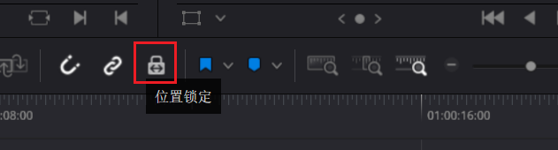  

### 旗标

标注整段原始素材，哪怕素材被切割了，被剪断的素材仍然会保留旗标 ，在素材箱里也会显示这个旗标。可以通过不同颜色的旗标来区分不同类别的素材

 

 

### 标记

**可以在时间线上标记。也可以选中时间线上的素材标记**

 

双击标记，可以添加备注或者关键词,或者把它移除  

 

添加了备注的，鼠标滑过会显示

 

## 如何找回视频的音频或者音频的视频？ 

先把时间轴的帧放到需要找回的音频或者视频上，然后按 f 键，素材监视器就显示这段素材了，然后拖住视频（音频）放到时间线上就行了  

但是，此时音视频是分隔的，需要手动链接他们，选中2者，右键 

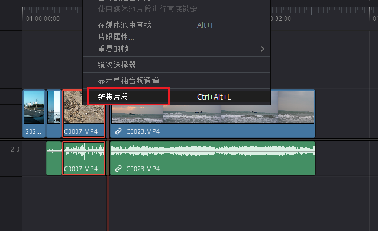 

## 给时间线上颜色

框选中一个片段

 

# 3、添加效果与关键帧 

## 效果和转场

在剪辑面板添加效果，点击特效库，选择你需要的效果，拖到对应的片段上即可 

 

转场也一样 ,注意， 直接把转场效果拖动到两条片段中间是没用的。 需要把前面的视频去尾，后面的视频去头。然后再拖动到两条视频中间就有转场效果了

这真是一个很奇怪的设定，但是没办法，达芬奇就是这样

https://www.zhihu.com/question/374950781/answer/2084229929

 

 

鼠标放到转场的左右两侧，可以修改转场的长度 

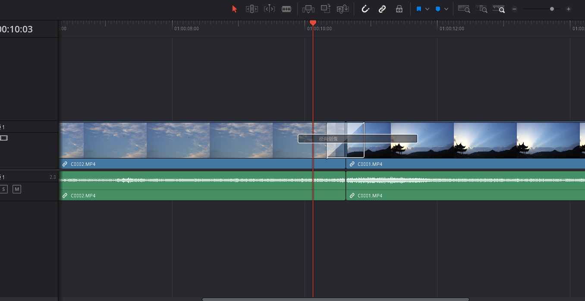

此时点击转场本身，就可以看到检查器这边,有转场的控制界面，可以修改转场的时长，方向等

 

## 静态的调整

当点击片段，检查器会变成对片段的控制

 

在这个页面，可以控制对片段的缩放，他的位置，旋转 等

 

在拖动位置等参数的时候，数字变化很快，此时如果按住alt再拖动，会变得慢很多

或者更加直观一点,点击时间监视器左下角红框内的按钮，进行调整 可以缩放和旋转 

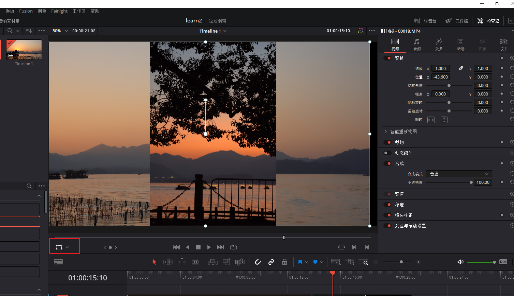 

裁切

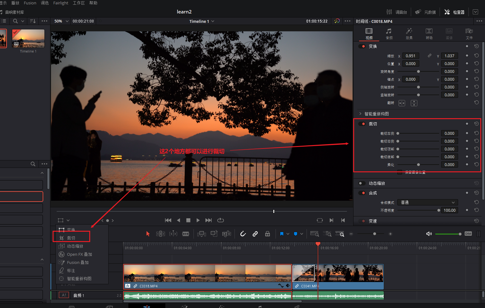 

## 动态的调整 

### 关键帧

例如画面的缓慢放大，旋转等

就要用到关键帧，就是告诉电脑，某个数值，要从x变到y 

 

如上图所示，这些参数右侧都有菱形，当时间轴的帧卡尺走到某个地方的时候，改变数值，打一个关键帧，走到另外一个地方的时候，改变数值，打一个关键帧(此时关键帧会自动帮你打上)，就会产生变化

如果后续想调整关键帧的时间，以及想在时间轴上看到关键帧，怎么办呢？ 如下图所示,可以拖动它的位置 

 

把时间轴指针移动到关键帧上（先选中某个关键帧点，然后拖动时间轴指针会吸附到这个关键帧上），可以修改某个关键帧的数值

如何删除关键帧的点呢？ 

   

当把所有关键帧删掉之后，再点击时间轴右下角的菱形，就没反应了

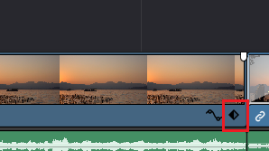  

最开头的关键帧按del是删不掉的，那怎么删除呢？ 

只需要把卡尺移到时间轴的最开头，然后把黄色激活的关键帧点击取消掉即可 

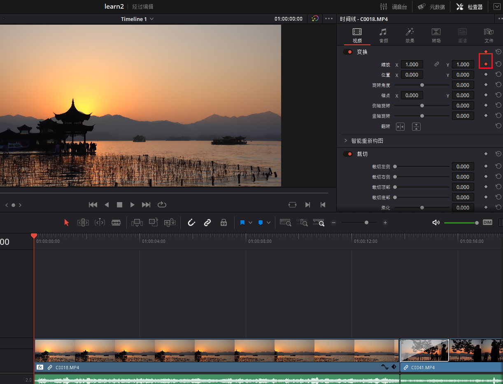 

如何让关键帧的变化比较平滑，曲线呢？ 默认的动画是线性的

 

 

如何做到渐变呢？ 

 

 

这条线就代表了你参数的变化   这些小的运动细节对片子的品质有着较大影响

曲线编辑器也可以显示多个参数，可以点击左上角  

 

### 批处理

把一个变化应用到很多片段上，不可能手动一个个去调整 

选择一个片段，按Ctrl + c 复制这个片段的你改动过的属性，然后在另一个片段上右键，选择粘贴属性 或者 Alt + V

  

会激活一个特殊的面板,在这个面板可以选择要黏贴过去的属性

 

#### 统一调整缩放

如果一个时间线上的多个素材缩放比例不同，有的4：3 有的16：9，2：1  

不可能一个个去调整缩放比例

此时可以

 

 

### 动态缩放比例

针对图片不需要手动去打关键帧，开启动态缩放，达芬奇会自动帮你给图片做好动态效果

 

如果自动的不满意，如果想调整缩放位置和大小的话 , 点击时间线监视器左下角

 

 

# 4 插件推荐

