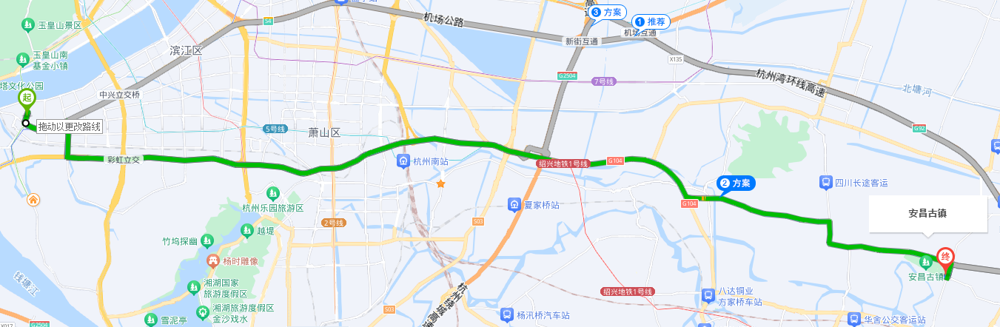
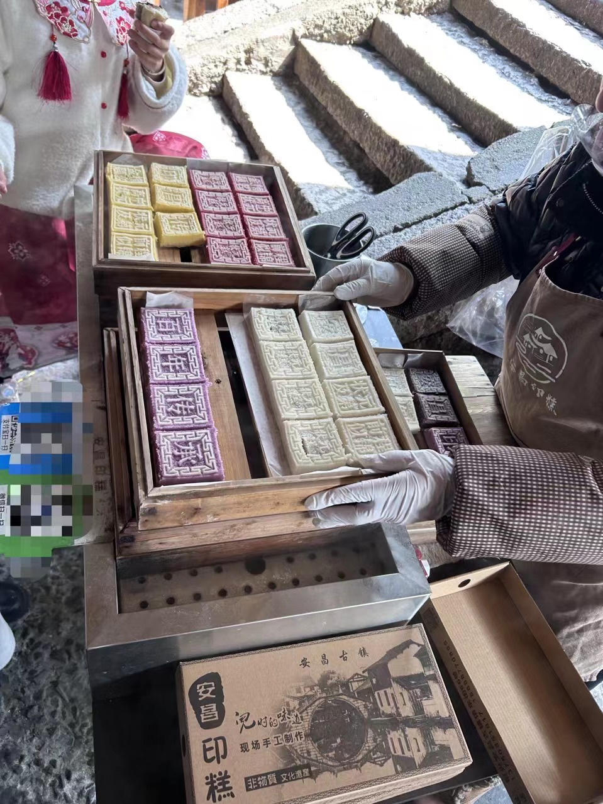

阳春三月，天气转暖，阳光充沛，某个普通的周六想出去逛逛散散心，于是选择了离杭州不远的安昌古镇去走走。 

杭州滨江开车过去大概1个小时 ，停车场很大随便停。  

 

一进古镇，先是许多的小吃摊，主要是绍兴臭豆腐，萝卜丝饼（油灯果）这些，香气扑鼻，于是买了些边吃边逛。

  

进入古镇，基本就是小桥流水的感觉。其实我们去过许多的古镇，有乌镇，龙门古镇，上海青浦朱家角。感觉最像这里的应该就是乌镇了，但是这里商业化没那么浓，而且免费。

在这么一个阳光明媚的周末，带着家人在这里走走,拍拍照，还是很惬意的。 

 

 

 

古镇比乌镇小，但还是比我想象中的大一些，不至于逛一下就没了，我们从早上11点逛到下午的14：00. 

安昌古镇的店铺都是沿河的，所以饭店，茶店都是可以边吃边欣赏古镇美景的。 

 

 

中饭我们在古镇上随便找了一家饭店吃的，并不好吃，不推荐。 如果有朋友下次去安昌古镇，还是找家馄饨店或者面店吃下就好了。 

   

 小镇特色是下图的安昌印糕 

河内有乌篷船穿梭来往。船夫用脚摇橹，手掌舵，船在水面上开得又快又稳，真是好技术啊。  

<video width="800" height="500" controls="controls">
    <source src="9.MP4" type="video/mp4">
</video>
